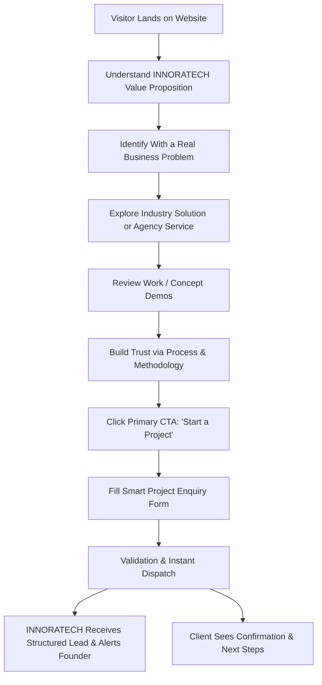
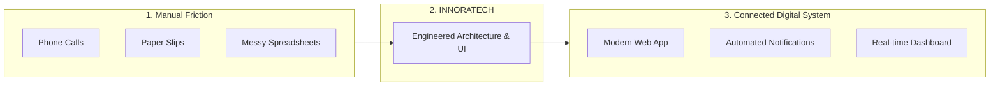
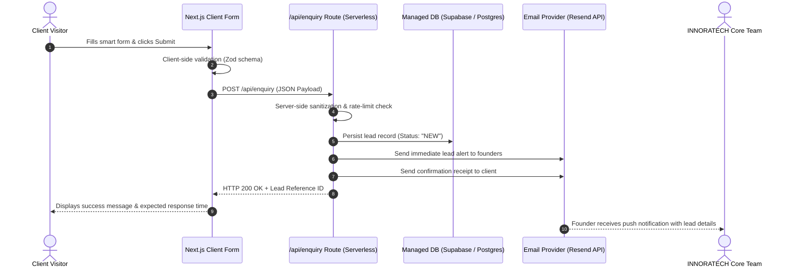

# INNORATECH Website — Project Requirements Document (PRD) v1.0

> **Document Status:** Baseline Approved  
> **Version:** 1.0  
> **Target Release:** V1.0 Launch  
> **Primary Deployment:** Vercel  
> **Core Principle:** *"Professional enough to win the first client, simple enough to maintain, and flexible enough to evolve."*

---

## Table of Contents
1. [Project Information](#1-project-information)
2. [Business Objective](#2-business-objective)
3. [Brand Definition](#3-brand-definition)
4. [Target Users & Personas](#4-target-users--personas)
5. [Core User Journey](#5-core-user-journey)
6. [Website Structure & Information Architecture](#6-website-structure--information-architecture)
7. [Homepage Requirements](#7-homepage-requirements)
8. [Hero Visual & Conceptual Design](#8-hero-visual--conceptual-design)
9. [Problem Section](#9-problem-section)
10. [Solutions Section (By Outcome)](#10-solutions-section-by-outcome)
11. [Core Services Section (Agency Offerings)](#11-core-services-section-agency-offerings)
12. [Why INNORATECH Section](#12-why-innoratech-section)
13. [How We Work (Methodology & SOPs)](#13-how-we-work-methodology--sops)
14. [Work & Portfolio Strategy](#14-work--portfolio-strategy)
15. [Case Study Structure](#15-case-study-structure)
16. [Technical Credibility & Stack](#16-technical-credibility--stack)
17. [About Page Specifications](#17-about-page-specifications)
18. [Contact & Lead Generation Specifications](#18-contact--lead-generation-specifications)
19. [Smart Project Enquiry Architecture](#19-smart-project-enquiry-architecture)
20. [Lead Submission Pipeline & Lifecycle](#20-lead-submission-pipeline--lifecycle)
21. [Third-Party Backend & Services Architecture](#21-third-party-backend--services-architecture)
22. [Content Management & Admin Strategy](#22-content-management--admin-strategy)
23. [Functional Requirements (FR-01 to FR-12)](#23-functional-requirements)
24. [Non-Functional Requirements (NFR)](#24-non-functional-requirements)
25. [SEO & Discoverability Strategy](#25-seo--discoverability-strategy)
26. [Analytics & Conversion Tracking](#26-analytics--conversion-tracking)
27. [Responsive Breakpoints & Layout](#27-responsive-breakpoints--layout)
28. [Out of Scope for V1](#28-out-of-scope-for-v1)
29. [Future Roadmap (V2 & Beyond)](#29-future-roadmap-v2--beyond)
30. [Technical Architecture Specification](#30-technical-architecture-specification)
31. [Repository & Codebase Structure](#31-repository--codebase-structure)
32. [Acceptance Criteria & Launch Checklist](#32-acceptance-criteria--launch-checklist)
33. [V1 Definition of Success](#33-v1-definition-of-success)

---

## 1. Project Information

| Property | Specification |
| :--- | :--- |
| **Project Name** | INNORATECH Official Website |
| **Project Type** | Agency / Business Website & Lead Engine |
| **Version** | V1.0 |
| **Primary Goal** | Generate qualified business enquiries; communicate positioning, capabilities, industry solutions, and credibility. |
| **Primary Deployment** | Vercel (Edge / Serverless runtime) |
| **Architecture** | Modern Serverless + Managed third-party services |
| **Primary Audience** | Small and medium-sized businesses (SMBs), starting with Restaurants and Hotels, followed by Manufacturers and Retailers. |

---

## 2. Business Objective

The website must establish **INNORATECH** as a high-caliber technology and business-solutions agency dedicated to helping businesses eliminate manual friction and replace obsolete, paper/phone-based processes with integrated digital systems.

### Core Objectives
1. **Clarity of Purpose:** Instantly explain what INNORATECH does within 5 seconds of arrival.
2. **Problem Demonstration:** Surface relatable business headaches (e.g., missed phone orders, chaotic spreadsheets, manual booking reconciliations).
3. **Structured Offerings:** Present services and industry-specific packaged solutions cleanly separated.
4. **Credibility & Trust:** Prove technical and operational competence through transparent workflows and transparent concept demos.
5. **High-Conversion Inbound:** Channel qualified decision-makers into an intuitive smart enquiry flow.
6. **Scalable Foundation:** Build a clean architectural base ready to host real case studies, MDX articles, and future CMS expansions.
7. **Dual-Market Appeal:** Deliver equal resonance for local Indian SMBs and international clients looking for streamlined digital transformation.

---

## 3. Brand Definition

```
  ==============================================================
   AGENCY NAME:        INNORATECH
   CORE POSITIONING:   Helping businesses replace manual processes with
                       modern websites, web applications, and digital
                       automation.
   PRIMARY TAGLINE:    Turn Manual Work Into Digital Solutions.
  ==============================================================
```

### Ideal Customer Profiles (ICP)

- **Initial Primary ICP:** Restaurants & Hotels (Hospitality businesses with acute manual booking/ordering bottlenecks).
- **Secondary ICP:** Small Manufacturers & Retail Businesses (Supply, order-tracking, catalog, and inventory sync challenges).
- **Additional ICPs:** Clinics, Hospitals, Salons, and local service providers managing appointments and customer follow-ups manually.

---

## 4. Target Users & Personas

### Primary User: The Business Owner
*e.g., Restaurant Owner, Hotelier, Bakery Proprietor, Retail Store Owner, Small Factory Director, Clinic Operator.*

- **Mindset & Goals:** Busy, pragmatic, ROI-focused. Does not care about esoteric tech jargon; cares about saving time, reducing employee overhead, and capturing lost revenue.
- **Key Desires:**
  - Understand INNORATECH's value proposition in seconds.
  - Find their exact industry or business problem represented.
  - Assess whether INNORATECH is capable and trustworthy.
  - Review concrete proof / interactive concept demos.
  - Initiate contact effortlessly without wading through a bureaucratic funnel.

### Secondary User: The Operations / Technical Decision Maker
*e.g., Operations Manager, General Manager, IT Lead, Co-founder / CTO.*

- **Mindset & Goals:** Systematic, detail-oriented, concerned with integration risks, security, API connectivity, and operational reliability.
- **Key Desires:**
  - Understand how systems connect (POS, PMS, payment gateways, WhatsApp/email alerts).
  - Review architecture, modern stack, scalability, and code hygiene.
  - Evaluate implementation speed and handover/maintenance SOPs.

---

## 5. Core User Journey

The website provides a frictionless path from problem recognition to enquiry dispatch, avoiding multi-tiered barriers.



---

## 6. Website Structure & Information Architecture

### V1 Page Hierarchy

```
innoratech-website/
├── / (Home)
│   ├── Hero (Value Prop + Concept Visual + Dual CTAs)
│   ├── Problem Diagnosis ("Still Running Important Processes Manually?")
│   ├── Industry Solutions Preview (Restaurants, Hotels, Bakeries, Custom Automation)
│   ├── Agency Core Services (Websites, Web Apps, Automations, Integrations, Maintenance)
│   ├── Why INNORATECH (Outcome-driven philosophy)
│   ├── 7-Step Delivery Process
│   ├── Featured Work & Demos
│   └── Inbound CTA Strip
├── /solutions
│   ├── /solutions/restaurants (Online ordering, QR table ordering, POS/kitchen flows)
│   ├── /solutions/hotels (Direct booking engine, PMS/WhatsApp alerts, guest check-in)
│   ├── /solutions/bakeries (Custom cake orders, production schedule, e-commerce)
│   └── /solutions/custom-business-automation (Internal dashboards, CRM, sync scripts)
├── /services (Business Websites, Web Apps, Automation, Integrations, Cloud DevOps)
├── /work (Concept demos & case studies with clear Demo vs. Client labels)
│   ├── /work/restaurant-ordering
│   ├── /work/hotel-booking
│   └── /work/bakery-automation
├── /process (Deep dive into the 7-step engineering & delivery methodology)
├── /about (Origin, 4-member founding team, Mission, Vision)
└── /contact (Smart multi-select project enquiry form + direct contact details)
```

*Optional Legal Pages (To be added once approved copy is available):*
- `/privacy-policy`
- `/terms`

---

## 7. Homepage Requirements

The homepage serves as the primary storefront and conversion engine.

### Hero Section
- **Headline (H1):** `Turn Manual Work Into Digital Solutions.`
- **Supporting Copy:**  
  *INNORATECH helps businesses replace manual processes with modern websites, web applications, automation, and integrations.*
- **Primary CTA:** `Start a Project` (Triggers anchor/routing to Smart Enquiry Form)
- **Secondary CTA:** `Explore Solutions` (Scrolls to or links to `/solutions`)
- **Branding:** Prominent official INNORATECH logo placement in the navigation and hero backdrop.

---

## 8. Hero Visual & Conceptual Design

Avoid generic, lifeless corporate stock photography. Instead, visually depict the **transformation pipeline**:



---

## 9. Problem Section

- **Headline:** `Still Running Important Processes Manually?`
- **Subtext:** *Manual processes cost time, introduce human error, and cap your business's ability to grow.*

### Targeted Scenarios Grid

| Sector | The Manual Reality | The Business Cost |
| :--- | :--- | :--- |
| **Restaurants** | Orders taken across chaotic phone calls, paper slips, and high-commission 3rd-party aggregators. | High commission fees, lost orders during rush hour, zero customer data ownership. |
| **Hotels** | Bookings handled over WhatsApp chats, fragmented phone records, and uncoordinated OTAs. | Double-bookings, delayed confirmations, commission leaks. |
| **Retail & Bakeries** | Custom requests, stock levels, and order pickups managed on paper pads or chat logs. | Missed delivery dates, stock miscalculations, stressed staff. |
| **General Business Ops** | Repetitive data re-entry across disjointed spreadsheets and accounting tools. | Wasted employee payroll, slow turnaround times, bottlenecked growth. |

- **Section CTA:** `See How We Solve These Problems` (Navigates to `/solutions`)

---

## 10. Solutions Section (By Outcome)

Solutions are framed around **business outcomes**, not abstract programming languages.

### 1. Restaurant Solutions
- Direct online ordering portal (zero aggregator commissions).
- QR code dynamic table ordering & digital contactless menus.
- Real-time kitchen display & order management workflows.
- Instant payment integration (UPI, cards, wallets) and automated WhatsApp receipts.

### 2. Hotel Solutions
- Commission-free direct room booking engine.
- Instant reservation calendar with real-time room availability.
- Automated guest communication (WhatsApp / SMS check-in details & directions).
- PMS & accounting API integrations.

### 3. Bakery Solutions
- Custom cake builder with multi-attribute pricing (weight, flavor, design notes).
- Slot-based pickup and delivery scheduling.
- Automated daily production run-sheets for kitchen staff.
- Order status notifications sent directly to buyers.

### 4. Custom Business Automation
- Unified operations dashboards and internal management tools.
- Tailored lightweight CRM systems.
- Two-way API synchronizations between billing, inventory, and communication channels.
- Custom client-facing web applications.

- **Section CTA:** `Explore Solutions`

---

## 11. Core Services Section (Agency Offerings)

Clear demarcation between industry-specific packages and agency engineering capabilities:

```
  [1] Business Websites
      High-converting, performance-optimized websites built around clear commercial goals.

  [2] Web Applications
      Bespoke internal systems, portals, booking platforms, and custom SaaS-style tools.

  [3] Business Automation
      End-to-end automated pipelines that eliminate recurring, manual human data entry.

  [4] Third-Party Integrations
      Direct connections with Payment Gateways, WhatsApp Business API, CRMs, POS, and PMS.

  [5] Cloud Deployment & Maintenance
      Serverless cloud hosting, uptime monitoring, security patching, and proactive maintenance.
```

---

## 12. Why INNORATECH Section

Differentiates INNORATECH by rejecting empty buzzwords in favor of a pragmatic engineering philosophy:

| Avoid Generic Clichés ❌ | INNORATECH Reality & Commitment ✅ |
| :--- | :--- |
| *"We are the best developers"* | **Problem-First Discovery:** We analyze your actual operational bottlenecks before writing a single line of code. |
| *"Cheapest rates in town"* | **Practical, Right-Sized Engineering:** We build robust systems scaled to your true business needs without unnecessary bloat. |
| *"High quality deliverables"* | **Connected Systems:** We ensure websites, databases, and communication channels talk to each other seamlessly. |
| *"We do everything"* | **Long-Term Accountability:** We deploy on maintainable, low-cost serverless stacks and provide ongoing technical support. |

---

## 13. How We Work (Methodology & SOPs)

Communicates transparent, structured delivery aligned with professional software engineering standards:


1. **01 — Discover:** Deep dive into your existing operational workflow, manual bottlenecks, and business objectives.
2. **02 — Plan:** Define system requirements, user personas, technical architecture, and milestones.
3. **03 — Design:** Wireframe user flows, system states, and responsive interface layouts.
4. **04 — Build:** Full-stack development, database schema modeling, and API integration.
5. **05 — Test:** Rigorous multi-device QA, edge-case validation, security checks, and user testing.
6. **06 — Launch:** Domain setup, production deployment on Vercel, DNS records, and staff handover.
7. **07 — Support:** Ongoing monitoring, performance tuning, and continuous enhancements.

---

## 14. Work & Portfolio Strategy

### V1 Initial Portfolio Items (Concept Demonstrations)
To demonstrate technical capability before commercial case studies are completed, V1 showcases 3 fully functional concept builds:
1. **Restaurant Digital Ordering System** — Concept Project & Demo
2. **Hotel Direct Booking Platform** — Concept Project & Demo
3. **Bakery Custom Order & Production Workflow** — Concept Project & Demo

> [!IMPORTANT]
> **Ethical Integrity Rule:** Every project must be explicitly flagged with a visible badge:  
> `[INNORATECH Concept / Demo]` vs. `[Client Production Project]`.  
> We never misrepresent a demonstration project as a commissioned client engagement.

---

## 15. Case Study Structure

Each project card links to an in-depth case study template:

```
  ┌──────────────────────────────────────────────────┐
  │ 1. Project Title & Classification Badge          │
  │    (Client Project OR INNORATECH Concept Demo)   │
  ├──────────────────────────────────────────────────┤
  │ 2. The Business Problem                          │
  │    Context, constraints, and operational pain.   │
  ├──────────────────────────────────────────────────┤
  │ 3. Existing (Manual) Process                     │
  │    How orders/leads were lost or delayed.        │
  ├──────────────────────────────────────────────────┤
  │ 4. The INNORATECH Solution                       │
  │    System architecture and digital strategy.     │
  ├──────────────────────────────────────────────────┤
  │ 5. Key System Features & Highlights              │
  ├──────────────────────────────────────────────────┤
  │ 6. Technology Stack & Integration Details        │
  ├──────────────────────────────────────────────────┤
  │ 7. High-Fidelity UI Walkthrough / Screenshots   │
  ├──────────────────────────────────────────────────┤
  │ 8. Measured Outcomes & Results                   │
  │    (Real client metrics or benchmark demo stats) │
  └──────────────────────────────────────────────────┘
```

---

## 16. Technical Credibility & Stack

Technical credibility is communicated through modern, robust engineering choices presented after the business value proposition:

```
  LAYER                TECHNOLOGIES & CAPABILITIES
  ──────────────────────────────────────────────────────────────────────
  Frontend & Web       Next.js (App Router), TypeScript, Tailwind/Vanilla CSS,
                       Responsive semantic HTML5, Micro-interactions.
  Backend & APIs       Next.js Serverless Routes, Node.js, REST & GraphQL endpoints,
                       Webhook listeners, Secure Auth.
  Database & Storage   Supabase / Managed PostgreSQL, Edge Caching, Encrypted storage.
  Automations & Comms  Resend (Transactional Email), WhatsApp Business API,
                       Automated webhook triggers, Cron job runners.
  Integrations         Stripe / Razorpay Payment Gateways, POS systems, PMS APIs,
                       Google Workspace, Custom third-party APIs.
```

---

## 17. About Page Specifications

- **Headline:** `Engineers & Problem Solvers Dedicated to Business Digitization`
- **Who We Are:** A four-member technology agency focused on helping businesses digitize manual processes and scale their operations.
- **Mission:** Help businesses adopt practical, cost-effective digital systems that simplify daily operations and elevate the customer experience.
- **Vision:** Build a world-class technology solutions agency trusted by businesses both locally across India and internationally.
- **The Team:**
  - Founder / Member 1: Name, Role, Bio, GitHub/LinkedIn links.
  - Founder / Member 2: Name, Role, Bio, GitHub/LinkedIn links.
  - Founder / Member 3: Name, Role, Bio, GitHub/LinkedIn links.
  - Founder / Member 4: Name, Role, Bio, GitHub/LinkedIn links.

---

## 18. Contact & Lead Generation Specifications

The contact page and floating CTA triggers must serve as a smart project enquiry engine.

### Form Fields Specification

| Field Name | Type | Mandatory? | Description |
| :--- | :--- | :--- | :--- |
| `fullName` | Text | **Yes** | Client full name |
| `businessName`| Text | **Yes** | Operating company / brand name |
| `email` | Email | **Yes** | Contact email address |
| `phone` | Tel | **Yes** | WhatsApp / Phone number with country code |
| `businessType` | Select / Radio | **Yes** | Restaurant, Hotel, Bakery, Retail, Manufacturing, Clinic, Other |
| `servicesNeeded`| Multi-select | **Yes** | Smart Selection (See Section 19) |
| `problemDescription` | Textarea | **Yes** | What manual process or challenge needs solving? |
| `websiteUrl` | URL | No | Current website or Instagram/social link |
| `budgetRange` | Select | No | Indicative investment tier |
| `preferredContact` | Radio | No | WhatsApp / Email / Phone Call |
| `additionalNotes` | Textarea | No | Timelines, existing tools, or notes |

- **Submit Button CTA:** `Let's Discuss Your Project`

---

## 19. Smart Project Enquiry Architecture

Instead of a generic single-input message box, users can multi-select what they need:

```
  [ ] Business Website
  [ ] Online Ordering System
  [ ] Direct Booking System
  [ ] E-commerce Store
  [ ] Business Process Automation
  [ ] Custom Web Application
  [ ] API & System Integration
  [ ] Ongoing Support & Maintenance
  [ ] Not Sure — I need a free consultation
```

---

## 20. Lead Submission Pipeline & Lifecycle



### Lead Object Data Schema

```json
{
  "id": "lead_uuid_12345",
  "createdAt": "2026-09-26T17:15:00.000Z",
  "sourceUrl": "https://innoratech.com/solutions/restaurants",
  "status": "NEW",
  "contact": {
    "fullName": "Jane Doe",
    "businessName": "Blue Harbor Bistro",
    "email": "jane@blueharbor.com",
    "phone": "+91 98765 43210",
    "preferredContact": "WhatsApp"
  },
  "businessProfile": {
    "businessType": "Restaurant",
    "currentWebsite": "https://blueharbor.instagram.com",
    "budgetRange": "Tier 2",
    "servicesNeeded": ["Online Ordering System", "WhatsApp Receipts"]
  },
  "inquiryDetails": {
    "problemDescription": "We spend 3 hours daily recording phone delivery orders on paper."
  },
  "metadata": {
    "ipHash": "a1b2c3d4...",
    "userAgent": "Mozilla/5.0..."
  }
}
```

---

## 21. Third-Party Backend & Services Architecture

To maximize velocity, maintain cost efficiency on generous free tiers, and minimize infrastructure maintenance overhead:

```
  ┌─────────────────────────────────────────────────────────────┐
  │                 DEPLOYMENT RUNTIME: VERCEL                  │
  │                     Next.js + TypeScript                    │
  ├─────────────────────────────────────────────────────────────┤
  │ DATABASE:           Supabase / Managed PostgreSQL           │
  │                     Stores lead records, status & logs      │
  ├─────────────────────────────────────────────────────────────┤
  │ TRANSACTIONAL EMAIL: Resend API                             │
  │                     High-deliverability instant alerts      │
  ├─────────────────────────────────────────────────────────────┤
  │ ANALYTICS:          Vercel Analytics & Google Analytics 4   │
  │                     Privacy-friendly telemetry & funnels    │
  ├─────────────────────────────────────────────────────────────┤
  │ STATIC CONTENT:     MDX / TypeScript Structured Data        │
  │                     Zero CMS latency, versioned via Git     │
  └─────────────────────────────────────────────────────────────┘
```

---

## 22. Content Management & Admin Strategy

### V1 Strategy: Git-as-CMS
- **Zero custom admin UI overhead.** No login portals or vulnerable admin routes.
- Content resides in typed TypeScript data objects (`/content/solutions/*.ts`) and Markdown/MDX files (`/content/work/*.mdx`).
- Non-developer updates are handled via Git PRs or structured config files.

### V2 Expansion Strategy
- Evaluate Headless CMS solutions (Sanity, Strapi, or Supabase CMS) when editorial frequency exceeds weekly publishing cadence.

---

## 23. Functional Requirements

- **FR-01 (Navigation):** Global header and footer must allow seamless single-click navigation across all primary pages and anchor targets.
- **FR-02 (Responsive UI):** All views must render flawlessly across mobile (375px+), tablet (768px+), desktop (1024px+), and wide screens (1440px+).
- **FR-03 (Interactive Enquiry Form):** Smart form must dynamically validate inputs, disable duplicate submissions during transit, and handle network faults gracefully.
- **FR-04 (Real-time Lead Notification):** System must dispatch instant email/webhook notifications to INNORATECH founders upon every valid lead submission.
- **FR-05 (Lead Persistence):** Submissions must be immutably recorded in the persistent database with timestamp, status, and payload.
- **FR-06 (CTA Tracking):** Primary CTAs (`Start a Project`, `Explore Solutions`, `Submit`) must dispatch custom analytics event triggers.
- **FR-07 (Work & Portfolio Details):** Work cards must link to comprehensive project breakdown pages featuring problem, solution, stack, and results.
- **FR-08 (SEO Metadata Automation):** Every route must define dynamic Open Graph, Twitter Cards, canonical tags, and descriptive title/meta descriptions.
- **FR-09 (Automated Sitemap):** Automatic generation of `sitemap.xml` on build.
- **FR-10 (Robots Policy):** Clean `robots.txt` configuration with appropriate crawler directives.
- **FR-11 (Error Recovery):** Display accessible error feedback on network failures, validation errors, and missing pages (404/500).
- **FR-12 (Confirmation States):** Unambiguous success screen presented upon enquiry dispatch with expected SLA (e.g., "We will contact you within 24 business hours").

---

## 24. Non-Functional Requirements (NFR)

### Performance
- **Target Lighthouse Score:** > 90 across Performance, Accessibility, Best Practices, and SEO.
- **Core Web Vitals:** LCP < 2.0s, FID/INP < 100ms, CLS < 0.1.
- Modern image compression (WebP/AVIF), font preloading, and aggressive server-side caching.

### Accessibility (a11y)
- WCAG 2.1 Level AA compliance.
- Semantic HTML5 landmark tags (`<header>`, `<main>`, `<nav>`, `<section>`, `<footer>`).
- Contrast ratios >= 4.5:1 for body text, keyboard tabbable controls, and explicit form `aria-` labels.

### Security
- Server-side payload validation via Zod; strict HTML entity sanitization.
- Rate limiting on API endpoints to prevent spam abuse.
- Zero public exposure of backend credentials, service keys, or environment secrets.

### Reliability & Availability
- 99.9% uptime SLA backed by Vercel's global edge network.
- Failover handling: if email dispatch encounters an intermittent outage, the lead record remains preserved in the database.

### Maintainability
- 100% TypeScript coverage with strict mode enabled.
- Modular component architecture following Single Responsibility principles.

---

## 25. SEO & Discoverability Strategy

- **Semantic Hierarchy:** Single `<h1>` tag per page followed by logical `<h2>`/`<h3>` outlines.
- **Meta Tags:** Distinct title templates (`<Page Name> | INNORATECH — Turn Manual Work Into Digital Solutions`).
- **Structured Data:** JSON-LD schema markup for `Organization`, `Service`, and `WebSite`.
- **Clean URLs:** Human-readable slugs (`/solutions/restaurants`, `/work/hotel-booking`).
- **Open Graph Protocol:** Custom branded social preview images for shared URLs.

---

## 26. Analytics & Conversion Tracking

Event-driven tracking framework monitoring critical funnel milestones:

```
  EVENT NAME                  TRIGGER CONDITION
  ─────────────────────────────────────────────────────────────
  page_view                   User navigates to any route
  cta_click_hero_primary      User clicks "Start a Project" in hero
  cta_click_hero_secondary    User clicks "Explore Solutions" in hero
  solution_view               User views an industry solution page
  work_demo_view              User views a demo/case study page
  enquiry_form_started        User interacts with first form field
  enquiry_form_submitted      User successfully dispatches enquiry
  enquiry_form_error          Validation or network error occurs
```

---

## 27. Responsive Breakpoints & Layout

```
  BREAKPOINT       VIEWPORT WIDTH     TARGET DEVICES
  ─────────────────────────────────────────────────────────────
  sm               375px - 639px      Smartphones (iPhone, Android)
  md               640px - 767px      Large phones, Phablets
  lg               768px - 1023px     Tablets, iPads (Portrait/Landscape)
  xl               1024px - 1279px    Laptops, Standard Desktops
  2xl              1280px+            Wide Screen Monitors & Workstations
```

*Design Philosophy:* **Mobile-First Responsive Design.** Layouts expand gracefully as screen real estate increases, rather than crushing desktop views down.

---

## 28. Out of Scope for V1

The following features are explicitly excluded from V1 to preserve speed to launch:

```
  ❌ Client Authentication / Customer Login Portals
  ❌ Custom Database CRM Admin Panel
  ❌ Live Blog CMS Engine
  ❌ Customer Self-Service Dashboards
  ❌ Native In-App Payment Checkout (For INNORATECH services)
  ❌ Complex Real-Time Booking Calendar System (For the agency itself)
  ❌ Multi-Vendor E-commerce Backend
  ❌ Automated AI Live Chatbot
  ❌ Native iOS/Android Mobile Applications
  ❌ Multi-Language / i18n Localization
  ❌ Custom In-House Analytics Dashboard
  ❌ Heavy Third-Party Monolithic CMS
```

---

## 29. Future Roadmap (V2 & Beyond)

- **Phase 2.1:** Case Study CMS integration (Sanity or MDX Git-backed dynamic loader).
- **Phase 2.2:** Technical Insights / Blog engine for agency thought leadership and organic SEO.
- **Phase 2.3:** Direct Cal.com / Calendly meeting scheduling integration inside the contact flow.
- **Phase 2.4:** Dedicated Client Onboarding Portal for contract approvals and project milestone tracking.
- **Phase 2.5:** Interactive embedded sandbox demos for restaurant & hotel solutions.
- **Phase 2.6:** Multi-currency / internationalized pricing calculators.

---

## 30. Technical Architecture Specification

```
                          WORLD WIDE WEB / CLIENTS
                                     │
                                     ▼
                      ┌──────────────────────────────┐
                      │    VERCEL EDGE NETWORK       │
                      │  Next.js 14+ (App Router)    │
                      └──────────────┬───────────────┘
                                     │
         ┌───────────────────────────┼───────────────────────────┐
         │                           │                           │
         ▼                           ▼                           ▼
  STATIC / SSR PAGES          SERVERLESS APIS             TELEMETRY / OPS
  - Home (/)                  - POST /api/enquiry         - Vercel Analytics
  - Solutions (/solutions/*)  - GET /api/health           - GA4 Event Stream
  - Services (/services)      - Input Sanitization (Zod)  - Sentry Error Tracking
  - Work (/work/*)            - Rate-Limit Gate (Edge)
  - Process (/process)                       │
  - About (/about)                           │
  - Contact (/contact)                       ▼
                               ┌───────────────────────────┐
                               │   EXTERNAL INTEGRATIONS   │
                               ├───────────────────────────┤
                               │ 1. Supabase (PostgreSQL)  │
                               │    Stores persistent lead │
                               │ 2. Resend API             │
                               │    Sends founder email    │
                               │    Sends client receipt   │
                               └───────────────────────────┘
```

---

## 31. Repository & Codebase Structure

```
innoratech-website/
├── .github/                      # CI/CD workflows and PR templates
├── app/                          # Next.js App Router root
│   ├── favicon.ico
│   ├── layout.tsx                # Global layout with Header, Footer, Providers
│   ├── page.tsx                  # High-impact Homepage
│   ├── solutions/
│   │   ├── page.tsx              # Solutions Overview
│   │   ├── restaurants/page.tsx  # Restaurant Vertical
│   │   ├── hotels/page.tsx       # Hotel Vertical
│   │   ├── bakeries/page.tsx     # Bakery Vertical
│   │   └── custom-business-automation/page.tsx
│   ├── services/
│   │   └── page.tsx              # Core Agency Services
│   ├── work/
│   │   ├── page.tsx              # Portfolio & Demos index
│   │   ├── restaurant-ordering/page.tsx
│   │   ├── hotel-booking/page.tsx
│   │   └── bakery-automation/page.tsx
│   ├── process/
│   │   └── page.tsx              # 7-Step Delivery Process
│   ├── about/
│   │   └── page.tsx              # Agency Vision & Team
│   ├── contact/
│   │   └── page.tsx              # Dedicated Smart Enquiry View
│   ├── api/
│   │   └── enquiry/
│   │       └── route.ts          # Serverless Lead Submission Handler
│   ├── sitemap.ts                # Dynamic sitemap generator
│   └── robots.ts                 # Dynamic robots generator
├── components/
│   ├── layout/
│   │   ├── Header.tsx            # Sticky header with logo & responsive drawer
│   │   └── Footer.tsx            # Global footer with link columns & legal
│   ├── sections/
│   │   ├── Hero.tsx              # Homepage hero with transformational graphic
│   │   ├── ProblemSection.tsx    # Friction comparison table
│   │   ├── SolutionsPreview.tsx  # Outcome cards
│   │   ├── ServicesGrid.tsx      # Agency offerings
│   │   ├── WhyInnoratech.tsx     # Differentiator cards
│   │   ├── ProcessTimeline.tsx   # 7-step interactive roadmap
│   │   └── WorkShowcase.tsx      # Demo cards with badge labeling
│   ├── ui/
│   │   ├── Button.tsx            # Design-system buttons
│   │   ├── Card.tsx              # Glassmorphic / elevation containers
│   │   ├── Badge.tsx             # "Concept Demo" vs "Client Project"
│   │   └── SectionHeader.tsx     # Standardized section headings
│   └── forms/
│       └── SmartEnquiryForm.tsx  # Multi-select lead capture form
├── content/
│   ├── solutions/                # Structured solutions copy
│   ├── services/                 # Structured services copy
│   └── work/                     # Case studies & demo breakdowns
├── lib/
│   ├── analytics/                # Event tracking dispatchers
│   ├── validation/               # Zod validation schemas
│   └── services/                 # Email & Database client abstractions
├── public/
│   ├── brand/                    # Official INNORATECH SVGs & logos
│   ├── images/                   # UI mockups, diagrams, team photos
│   └── icons/                    # Custom SVGs & badges
├── types/
│   ├── enquiry.ts                # TypeScript lead & form definitions
│   └── content.ts                # Content model typings
├── docs/
│   └── PRD.md                    # This Project Requirements Document
├── tailwind.config.ts / css      # Design system tokens & utility config
├── tsconfig.json
├── package.json
└── README.md
```

---

## 32. Acceptance Criteria & Launch Checklist

The website is formally marked **V1 Complete** when every item below is verified:

### 1. Branding & Identity
- [ ] Official INNORATECH vector logo rendered in navigation, footer, and open graph assets.
- [ ] Curated typography hierarchy implemented (Google Fonts: Outfit / Inter).
- [ ] Primary palette (Deep Tech Navy, Vibrant Accent, Slate Neutrals) unified across all views.
- [ ] Branded favicon package (16x16, 32x32, Apple Touch Icon) created and verified.

### 2. Pages & Navigation
- [ ] All primary routes (`/`, `/solutions/*`, `/services`, `/work/*`, `/process`, `/about`, `/contact`) fully functional.
- [ ] Zero dead, circular, or 404 links.
- [ ] Smooth scrolling and responsive mobile drawer navigation tested.
- [ ] All CTA buttons route to the proper destination or trigger the smart enquiry modal.

### 3. Lead Generation & Contact Workflow
- [ ] Smart multi-select enquiry form validates both client-side and server-side.
- [ ] Form submission captures complete payload with timestamp, source page, and status `NEW`.
- [ ] Lead record securely written to persistent storage (Supabase / Postgres).
- [ ] Instant notification email delivered to INNORATECH founders.
- [ ] Confirmation feedback and clear SLA presented to the user.
- [ ] Error states and network timeout handling verified.

### 4. Search Engine Optimization (SEO)
- [ ] Unique title tags and compelling meta descriptions on every route.
- [ ] Open Graph and Twitter Card tags configured with absolute image paths.
- [ ] Automated `sitemap.xml` accessible and verified.
- [ ] `robots.txt` correctly configured.
- [ ] Semantic HTML5 markup audited (`<h1>` uniqueness, alt tags on all imagery).

### 5. Quality, Performance & Accessibility
- [ ] Lighthouse audit scores >= 90 across all categories.
- [ ] Zero layout shifts (CLS < 0.1).
- [ ] Multi-device QA passed (iPhone Safari, Android Chrome, Mac Chrome/Safari, Windows Edge).
- [ ] Full keyboard navigation and screen-reader contrast checks passed.

### 6. Production Deployment
- [ ] Production build cleanly compiles on Vercel with zero TypeScript or lint errors.
- [ ] Custom domain linked with active SSL/HTTPS certificate.
- [ ] Environment variables (API keys, DB connection strings) securely encrypted.
- [ ] Analytics telemetry stream operational.

---

## 33. V1 Definition of Success

> **"Professional enough to win the first client, simple enough to maintain, and flexible enough to evolve."**

INNORATECH V1 is not an over-engineered enterprise experiment. It is a razor-sharp, outcome-oriented conversion engine designed to do one fundamental job:

**Convert a visiting business owner who discovers INNORATECH into an eager, qualified client conversation.**
