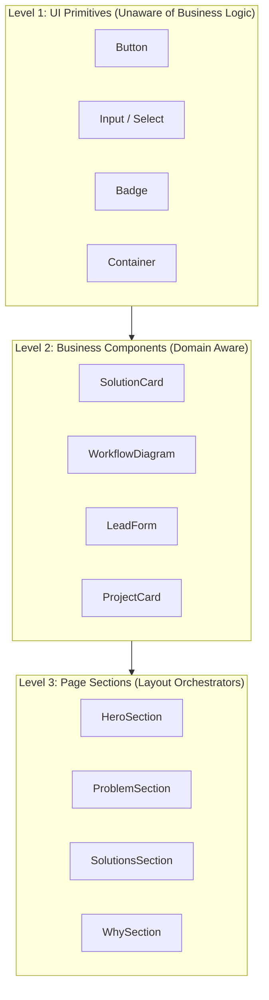
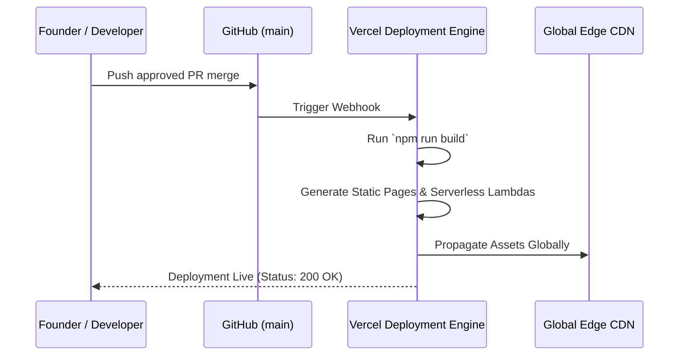
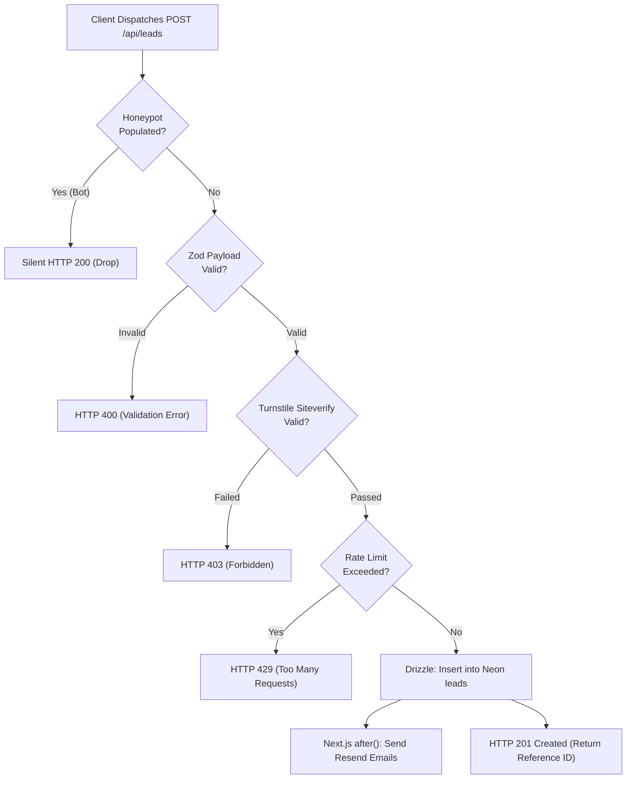

# INNORATECH Website — Technical Architecture & Implementation Specification v1.0

> **Document Status:** Approved Engineering Baseline  
> **Version:** 1.0  
> **Companion Documents:** [PRD.md](file:///c:/Users/shash/OneDrive/Desktop/INNORATECH/website_v1/PRD.md) • [UI_UX_SPECIFICATION.md](file:///c:/Users/shash/OneDrive/Desktop/INNORATECH/website_v1/UI_UX_SPECIFICATION.md)  
> **Primary Engineering Directive:** *"Static-first, serverless-when-needed. High performance, zero unnecessary servers, rock-solid lead capture."*

---

## Executive Summary

While the **PRD** specifies *what* the website does and the **UI/UX Specification** governs *how* it looks and feels, this **Technical Architecture Specification** locks the engineering decisions, code standards, data contracts, security rules, and deployment pipelines.

The architecture centers around **Next.js 16.3.x + TypeScript + Vercel + Neon PostgreSQL + Drizzle ORM + Resend + Cloudflare Turnstile**. The application runs predominantly as a high-speed, statically rendered / React Server Component (RSC) site, invoking serverless compute solely for contact/lead ingest, spam gating, database persistence, and transactional email dispatch.

---

## Table of Contents
1. [Architecture Decision & Final V1 Stack](#1-architecture-decision--final-v1-stack)
2. [High-Level Architecture Diagram](#2-high-level-architecture-diagram)
3. [Core Architectural Principle](#3-core-architectural-principle)
4. [Rendering Strategy (RSC vs. Client Components)](#4-rendering-strategy-rsc-vs-client-components)
5. [App Router Route Architecture](#5-app-router-route-architecture)
6. [Repository Structure Blueprint](#6-repository-structure-blueprint)
7. [Three-Level Component Architecture](#7-three-level-component-architecture)
8. [Design Tokens & Styling Integration](#8-design-tokens--styling-integration)
9. [Content Architecture (Git-as-CMS)](#9-content-architecture-git-as-cms)
10. [Database Architecture & Decision (Neon Postgres)](#10-database-architecture--decision-neon-postgres)
11. [Database Schema Specification (Drizzle ORM)](#11-database-schema-specification-drizzle-orm)
12. [Database Security Rules](#12-database-security-rules)
13. [ORM Strategy (Drizzle ORM)](#13-orm-strategy-drizzle-orm)
14. [Contact Form API Workflow](#14-contact-form-api-workflow)
15. [Serverless Route Handler Rationale](#15-serverless-route-handler-rationale)
16. [Route Handlers vs. Server Actions](#16-route-handlers-vs-server-actions)
17. [Email Architecture (Resend)](#17-email-architecture-resend)
18. [Email Reliability & Non-Blocking Async Execution](#18-email-reliability--non-blocking-async-execution)
19. [Anti-Spam Strategy (Cloudflare Turnstile + Honeypot)](#19-anti-spam-strategy-cloudflare-turnstile--honeypot)
20. [Rate Limiting Strategy](#20-rate-limiting-strategy)
21. [Input Validation Schema (Zod)](#21-input-validation-schema-zod)
22. [Environment Variables Matrix](#22-environment-variables-matrix)
23. [Environment Lifecycle (Dev, Preview, Prod)](#23-environment-lifecycle-dev-preview-prod)
24. [Git & Branching Workflow](#24-git--branching-workflow)
25. [GitHub Repository Governance & Rules](#25-github-repository-governance--rules)
26. [CI/CD Automated Quality Gates](#26-cicd-automated-quality-gates)
27. [Next.js Configuration (`next.config.ts`)](#27-nextjs-configuration-nextconfigts)
28. [Edge Caching & Invalidation Strategy](#28-edge-caching--invalidation-strategy)
29. [SEO & Metadata Architecture](#29-seo--metadata-architecture)
30. [Performance Engineering Standards](#30-performance-engineering-standards)
31. [Web Analytics & Event Taxonomy](#31-web-analytics--event-taxonomy)
32. [Lead Attribution & UTM Extraction](#32-lead-attribution--utm-extraction)
33. [Global Error Handling Strategy](#33-global-error-handling-strategy)
34. [Application Security Architecture](#34-application-security-architecture)
35. [Security Headers & Content Security Policy (CSP)](#35-security-headers--content-security-policy-csp)
36. [Accessibility (a11y) Architecture](#36-accessibility-a11y-architecture)
37. [Deployment Pipeline on Vercel](#37-deployment-pipeline-on-vercel)
38. [Custom Domain & DNS Routing](#38-custom-domain--dns-routing)
39. [Production Email Domain Verification](#39-production-email-domain-verification)
40. [Database Migration Lifecycle](#40-database-migration-lifecycle)
41. [System Telemetry & Monitoring](#41-system-telemetry--monitoring)
42. [Backup & Disaster Recovery Procedures](#42-backup--disaster-recovery-procedures)
43. [Data Privacy & Retention Policies](#43-data-privacy--retention-policies)
44. [Zero-Auth Policy for V1](#44-zero-auth-policy-for-v1)
45. [REST API Contract Specification (`POST /api/leads`)](#45-rest-api-contract-specification-post-apileads)
46. [Lead Ingest Decision Tree](#46-lead-ingest-decision-tree)
47. [Dependency Manifest & Version Lock](#47-dependency-manifest--version-lock)
48. [Package & Runtime Requirements](#48-package--runtime-requirements)
49. [TypeScript Strict Mode Rules](#49-typescript-strict-mode-rules)
50. [Code Standards & Server/Client Boundary Rules](#50-code-standards--serverclient-boundary-rules)
51. [Server vs. Client Component Matrix](#51-server-vs-client-component-matrix)
52. [8-Phase Implementation Roadmap](#52-8-phase-implementation-roadmap)
53. [Comprehensive Definition of Done](#53-comprehensive-definition-of-done)
54. [Final Architecture Summary & Anti-Bloat Manifesto](#54-final-architecture-summary--anti-bloat-manifesto)

---

## 1. Architecture Decision & Final V1 Stack

| Layer | Selected Technology | Rationale & Trade-offs |
| :--- | :--- | :--- |
| **Framework** | Next.js 16.3.x (App Router) | Active LTS security baseline; unifies server components, static generation, and edge route handlers. |
| **Language** | TypeScript 5.x | End-to-end type safety across data models, UI components, and API contracts. |
| **Rendering** | React Server Components (RSC) + Selective Client Leaves | Near-zero client-side JavaScript for marketing pages; client bundles reserved for interactive leaves. |
| **Styling** | Tailwind CSS + CSS Custom Properties | Fast build times, design tokens synchronized with CSS variables, zero runtime CSS overhead. |
| **Icons** | Lucide React | Uniform 2px stroke line iconography fitting the technical brand direction. |
| **Database** | Neon PostgreSQL | Serverless Postgres with instant scale-to-zero, connection pooling, and Vercel native integration. |
| **ORM** | Drizzle ORM | Zero-overhead, type-safe SQL query builder and schema declaration without heavy engine binaries. |
| **Validation** | Zod 3.x | Schema-driven runtime validation shared between form boundaries and API route handlers. |
| **Email Service** | Resend | High-deliverability transactional email API with native React Email template rendering. |
| **Anti-Bot / Security** | Cloudflare Turnstile | Frictionless, privacy-preserving CAPTCHA replacement designed for high form-completion rates. |
| **Hosting & Edge** | Vercel | Native Next.js edge caching, automatic serverless route handler provisioning, and Git preview deploys. |
| **Telemetry** | @vercel/analytics | First-party, privacy-compliant pageview and custom event funnel tracking without GDPR cookie banners. |
| **Content Strategy** | Typed TypeScript / MDX Objects | Git-versioned, zero-cost content modeling without CMS database latency or subscription fees. |

---

## 2. High-Level Architecture Diagram

```mermaid
flowchart TD
    subgraph Client ["Client Browser"]
        U["Visitor / Business Owner"]
    end

    subgraph Vercel ["Vercel Edge Platform"]
        Edge["Vercel Global CDN Edge"]
        RSC["Next.js 16 App Router\n(React Server Components)"]
        API["Serverless Route Handler\n/api/leads"]
        Telemetry["Vercel Web Analytics"]
    end

    subgraph External ["External Managed Services"]
        Turnstile["Cloudflare Turnstile API\n(Bot Verification)"]
        Neon["Neon PostgreSQL\n(Serverless DB Pool)"]
        Resend["Resend Transactional Email\n(React Email)"]
        Inbox["INNORATECH Founders\n(Push Notification)"]
    end

    U -->|1. Request Page| Edge
    Edge -->|Cache Hit| U
    Edge -->|Cache Miss / SSR| RSC
    RSC -->|Static HTML + Minimal JS| U
    U -->|2. Telemetry Events| Telemetry
    U -->|3. Submit Lead Form| API
    API -->|4. Verify Token| Turnstile
    Turnstile -->|Token Valid| API
    API -->|5. Insert Lead (Drizzle)| Neon
    API -->|6. Async Task (after())| Resend
    Resend -->|7. Instant Alert| Inbox
    API -->|8. HTTP 201 Created| U
```

---

## 3. Core Architectural Principle

```
  ===================================================================
   GOLDEN RULE: Static-first, serverless-when-needed.
  ===================================================================
```

Over 95% of INNORATECH's web presence consists of static or server-rendered educational and credibility assets:
- **Fully Static Routes:** `/`, `/solutions/*`, `/services/*`, `/work/*`, `/process`, `/about`.
- **Serverless Boundary:** Strictly reserved for `POST /api/leads` (ingest, validation, bot check, database persistence, and transactional email dispatch).

*Outcome:* Blazing TTFB, minimal compute costs, zero idle server fees, and resilience against traffic spikes.

---

## 4. Rendering Strategy (RSC vs. Client Components)

### Server Components by Default
All root layouts, route entries, static visual sections, marketing content blocks, and metadata generators are **React Server Components (RSC)**:
- Zero JavaScript shipped to the client for layout, marketing text, and structural grids.
- Data fetching (e.g., loading project case studies or service specs) occurs exclusively on the server.

### Client Components Only When Required (`"use client"`)
Client components are strictly isolated to interactive leaf nodes:
- `MobileMenu.tsx` (stateful slide-over drawer toggle).
- `LeadForm.tsx` (form field state, client-side Zod validation, Turnstile integration).
- `WorkflowInteractive.tsx` (interactive step toggles for pipeline diagrams).
- `Accordion.tsx` (collapsible FAQ components).

*Rule:* Never tag an entire page with `"use client"`. Wrap interactive widgets at the lowest possible level in the component tree.

---

## 5. App Router Route Architecture

```
src/app/
├── layout.tsx                     # Global HTML shell, font declarations, Header & Footer
├── page.tsx                       # Homepage (Static Server Component)
├── not-found.tsx                  # Branded 404 error screen
├── error.tsx                      # Global client boundary error fallback
├── globals.css                    # Tailwind directives & CSS variable tokens
│
├── solutions/
│   ├── page.tsx                   # Solutions Overview Index
│   ├── restaurants/page.tsx       # Restaurant Direct Ordering Solution
│   ├── hotels/page.tsx            # Hotel Booking Engine Solution
│   ├── bakeries/page.tsx          # Bakery Production & Order Solution
│   └── business-automation/page.tsx # Custom Automation Solution
│
├── services/
│   ├── page.tsx                   # Core Agency Services Index
│   └── [slug]/page.tsx            # Dynamic Deep-Dive Service Route
│
├── work/
│   ├── page.tsx                   # Portfolio & Demo Directory
│   └── [slug]/page.tsx            # Case Study / Demo Walkthrough
│
├── process/
│   └── page.tsx                   # 7-Step Delivery SOP Timeline
│
├── about/
│   └── page.tsx                   # Agency Origin, Mission & Founder Team
│
├── contact/
│   └── page.tsx                   # Dedicated Smart Project Enquiry Page
│
├── privacy-policy/
│   └── page.tsx                   # Legal Privacy Document
│
├── terms/
│   └── page.tsx                   # Terms of Service Document
│
├── sitemap.ts                     # Dynamic XML Sitemap generator
├── robots.ts                      # Dynamic robots.txt generator
│
└── api/
    └── leads/
        └── route.ts               # Serverless Lead Ingest Handler
```

---

## 6. Repository Structure Blueprint

```
innoratech-website/
├── public/
│   ├── brand/
│   │   ├── logo.svg               # Primary vector logo
│   │   ├── logo-dark.svg          # Inverted logo for dark backgrounds
│   │   ├── mark.svg               # Interlocking icon mark
│   │   └── favicon.svg            # Browser tab icon
│   ├── images/
│   │   ├── demos/                 # Real product UI screenshots
│   │   └── team/                  # Founder profile headshots
│   └── og/
│       └── og-default.png         # Social graph preview image (1200x630)
│
├── src/
│   ├── app/                       # Next.js App Router (Routes & Pages)
│   ├── components/
│   │   ├── ui/                    # Level 1: Button, Badge, Input, Card, Modal
│   │   ├── navigation/            # Navbar, MobileMenu, Footer, Breadcrumbs
│   │   ├── sections/              # Level 3: HeroSection, ProblemSection, WhySection
│   │   ├── cards/                 # Level 2: SolutionCard, ServiceCard, ProjectCard
│   │   ├── workflows/             # Interactive data pipeline diagrams
│   │   └── forms/                 # LeadForm, FormField, TurnstileWidget
│   │
│   ├── data/                      # Typed Content Files (Git-as-CMS)
│   │   ├── solutions.ts
│   │   ├── services.ts
│   │   ├── projects.ts
│   │   └── process.ts
│   │
│   ├── db/                        # Database Layer
│   │   ├── client.ts              # Neon serverless client connection
│   │   ├── schema.ts              # Drizzle table schemas and enums
│   │   └── migrations/            # Auto-generated SQL migration files
│   │
│   ├── lib/                       # Utility & Provider Abstractions
│   │   ├── env.ts                 # Validated environment variable schema
│   │   ├── validation.ts          # Zod schema for lead payloads
│   │   ├── rate-limit.ts          # IP-based in-memory request throttle
│   │   ├── turnstile.ts           # Cloudflare siteverify API client
│   │   ├── email.ts               # Resend client wrapper
│   │   └── utils.ts               # Tailwind cn() merger and helpers
│   │
│   ├── emails/                    # React Email Templates
│   │   ├── lead-notification.tsx  # Internal founder alert
│   │   └── lead-confirmation.tsx  # Customer confirmation receipt
│   │
│   ├── types/                     # Shared TypeScript Definitions
│   │   ├── lead.ts
│   │   ├── solution.ts
│   │   └── project.ts
│   │
│   └── styles/
│
├── drizzle.config.ts              # Drizzle ORM migration configuration
├── next.config.ts                 # Next.js build, headers & image configuration
├── tailwind.config.ts             # Tailwind CSS tokens & design extensions
├── tsconfig.json                  # Strict TypeScript compiler options
├── eslint.config.mjs              # Linting standards
├── package.json                   # Version manifests & execution scripts
└── .env.example                   # Sanitized environment variable template
```

---

## 7. Three-Level Component Architecture



- **Level 1 (Primitives):** Zero knowledge of agency models. Purely presentational with accessible props.
- **Level 2 (Business):** Binds domain models (e.g. `SolutionItem`) to UI primitives.
- **Level 3 (Sections):** Encapsulates responsive container grids, section IDs for smooth scrolling, and section rhythm backgrounds.

---

## 8. Design Tokens & Styling Integration

Tailwind CSS consumes CSS custom properties declared in `src/app/globals.css`:

```typescript
// tailwind.config.ts
import type { Config } from "tailwindcss";

const config: Config = {
  content: ["./src/**/*.{ts,tsx}"],
  theme: {
    extend: {
      colors: {
        brand: {
          primary: "var(--brand-primary)",
          hover: "var(--brand-primary-hover)",
          subtle: "var(--brand-primary-subtle)",
        },
        slate: {
          dark: "var(--bg-dark)",
          surface: "var(--bg-dark-surface)",
        }
      },
      borderRadius: {
        sm: "var(--radius-sm)",
        md: "var(--radius-md)",
        lg: "var(--radius-lg)",
      },
      maxWidth: {
        container: "var(--container-max)",
      }
    }
  }
};
export default config;
```

---

## 9. Content Architecture (Git-as-CMS)

No external CMS is provisioned for V1. Content is strictly typed and versioned in Git under `src/data/`:

```typescript
// src/data/solutions.ts
export interface SolutionItem {
  id: string;
  slug: string;
  badge: string;
  title: string;
  tagline: string;
  problemSummary: string;
  solutionSummary: string;
  features: string[];
  workflowSteps: { title: string; actor: string; description: string }[];
  impactMetrics: { label: string; value: string }[];
}

export const solutions: SolutionItem[] = [
  {
    id: "restaurants",
    slug: "restaurants",
    badge: "Hospitality Technology",
    title: "Direct Digital Ordering & Kitchen Flow",
    tagline: "Eliminate phone order chaos and 3rd-party commissions.",
    problemSummary: "Handwritten tickets and phone orders cause kitchen confusion...",
    solutionSummary: "A branded web ordering portal and QR table system...",
    features: [
      "Zero commission direct customer ordering",
      "QR code contactless table menus",
      "Real-time kitchen order display",
      "Instant WhatsApp receipts"
    ],
    workflowSteps: [
      { title: "QR Scan", actor: "Customer", description: "Opens instant web menu" },
      { title: "Order Selection", actor: "Customer", description: "Customizes cart & checks out" },
      { title: "Payment", actor: "Gateway", description: "Direct settlement to bank" },
      { title: "Preparation", actor: "Kitchen", description: "Receives ticket on dashboard" }
    ],
    impactMetrics: [
      { label: "Commission Fee", value: "0%" },
      { label: "Order Accuracy", value: "99.8%" }
    ]
  }
  // Hotels, Bakeries, Custom Automation...
];
```

---

## 10. Database Architecture & Decision (Neon Postgres)

- **Selected Engine:** **Neon PostgreSQL**.
- **Driver:** `@neondatabase/serverless` (utilizes WebSocket / HTTP pooling tuned for Vercel serverless environments).
- **Scale-to-Zero:** Neon automatically scales compute down during low activity, preserving the free-tier allowances.
- **Connection Isolation:** Direct pooled connection strings stored exclusively in `DATABASE_URL`.

---

## 11. Database Schema Specification (Drizzle ORM)

```typescript
// src/db/schema.ts
import { pgTable, text, timestamp, varchar, pgEnum } from "drizzle-orm/pg-core";

export const leadStatusEnum = pgEnum("lead_status", [
  "NEW",
  "CONTACTED",
  "QUALIFIED",
  "DISCOVERY_SCHEDULED",
  "PROPOSAL_SENT",
  "WON",
  "LOST"
]);

export const leads = pgTable("leads", {
  id: varchar("id", { length: 36 }).primaryKey(), // UUID v4
  createdAt: timestamp("created_at", { withTimezone: true }).defaultNow().notNull(),

  // Contact Details
  fullName: varchar("full_name", { length: 255 }).notNull(),
  businessName: varchar("business_name", { length: 255 }).notNull(),
  email: varchar("email", { length: 255 }).notNull(),
  phone: varchar("phone", { length: 50 }).notNull(),
  preferredContactMethod: varchar("preferred_contact_method", { length: 50 }).default("whatsapp").notNull(),

  // Project Profile
  businessType: varchar("business_type", { length: 100 }).notNull(),
  servicesNeeded: text("services_needed").notNull(), // JSON serialized array
  problemDescription: text("problem_description").notNull(),
  websiteUrl: varchar("website_url", { length: 500 }),
  budgetRange: varchar("budget_range", { length: 100 }),

  // Attribution & Context
  sourcePage: varchar("source_page", { length: 500 }).notNull(),
  referrer: varchar("referrer", { length: 500 }),
  utmSource: varchar("utm_source", { length: 100 }),
  utmMedium: varchar("utm_medium", { length: 100 }),
  utmCampaign: varchar("utm_campaign", { length: 100 }),

  // Operational State
  status: leadStatusEnum("status").default("NEW").notNull(),
  internalNotes: text("internal_notes"),
  turnstileVerified: timestamp("turnstile_verified", { withTimezone: true })
});

export type Lead = typeof leads.$inferSelect;
export type NewLead = typeof leads.$inferInsert;
```

---

## 12. Database Security Rules

1. **Zero Client DB Access:** The browser never imports `@neondatabase/serverless` or Drizzle modules.
2. **Strict Environment Containment:** `DATABASE_URL` is parsed exclusively inside server files (`src/db/client.ts`).
3. **No Direct User SQL:** All database reads and writes pass through type-checked Drizzle builders, preventing SQL injection vulnerabilities.

---

## 13. ORM Strategy (Drizzle ORM)

Drizzle ORM was chosen over Prisma because:
- **Zero Binary Overhead:** Does not require heavy Prisma Rust engines (`query-engine-node-api-bin`), keeping serverless cold starts < 50ms.
- **Pure SQL Transparency:** Schema mirrors PostgreSQL syntax 1:1.
- **Lightweight Migrations:** Migrations are generated into human-readable `.sql` scripts managed by `drizzle-kit`.

---

## 14. Contact Form API Workflow

`POST /api/leads` executes an 8-step pipeline:

```
  [1] Request Ingestion (Parse JSON body & client headers)
  [2] Honeypot Check (Reject immediately if 'company_website_confirm' is filled)
  [3] Zod Schema Validation (Enforce field lengths, valid email, and enum sets)
  [4] Cloudflare Turnstile Token Verification (Server-to-server validation)
  [5] Anti-Spam Rate Limit Check (IP-based sliding window)
  [6] Database Record Insert (Drizzle ORM write to Neon with status: 'NEW')
  [7] Asynchronous Notification Trigger (Next.js after() non-blocking email dispatch)
  [8] Client Response (Return HTTP 201 Created + Public Reference ID)
```

---

## 15. Serverless Route Handler Rationale

Why Next.js App Router Route Handlers over a separate Node/Express backend?
- **Zero Additional Hosting Infrastructure:** Runs inside Vercel's Edge/Serverless runtime.
- **Unified TypeScript Types:** Shared Zod schemas between form UI and backend handlers.
- **Lower Deployment Friction:** No multiple repository synchronizations or cross-origin CORS configurations required.

---

## 16. Route Handlers vs. Server Actions

For public contact form ingest, **Route Handlers (`POST /api/leads`)** are chosen over Server Actions because:
1. **Explicit HTTP Boundary:** Simplifies testing via Postman, Curl, and automated integration suites.
2. **Third-Party Webhook Compatibility:** Enables external forms or mobile webviews to submit leads using standard HTTP JSON payloads.
3. **Clean CORS & Turnstile Decoupling:** Isolates anti-bot verification and rate limiting to a clean REST endpoint.

---

## 17. Email Architecture (Resend)

Resend handles two transactional email streams:

### 1. Internal Founder Notification (`lead-notification.tsx`)
- **Recipient:** Founders / Sales team inbox (`leads@innoratech.com`).
- **Subject:** `[New Lead] <Business Name> — <Services Needed>`
- **Content:** Formatted card containing contact details, problem description, budget tier, and UTM attribution source.

### 2. Client Confirmation Receipt (`lead-confirmation.tsx`)
- **Recipient:** Prospect's email address.
- **Subject:** `We have received your project enquiry — INNORATECH`
- **Content:** Professional acknowledgment confirming receipt, summary of their request, and clear SLA (response within 24 business hours).

---

## 18. Email Reliability & Non-Blocking Async Execution

```
  ===================================================================
   RELIABILITY AXIOM: The database is the single source of truth.
  ===================================================================
```

If the email delivery provider encounters a temporary timeout or rate limit, **the lead must never be lost**.

### Non-blocking Execution via Next.js `after()` API
```typescript
import { after } from "next/server";
import { db } from "@/db/client";
import { leads } from "@/db/schema";
import { sendLeadNotificationEmail, sendLeadConfirmationEmail } from "@/lib/email";

export async function POST(request: Request) {
  // 1. Validate & Insert into DB
  const [leadRecord] = await db.insert(leads).values(sanitizedPayload).returning();

  // 2. Schedule email dispatch to run after HTTP response is returned
  after(async () => {
    try {
      await Promise.all([
        sendLeadNotificationEmail(leadRecord),
        sendLeadConfirmationEmail(leadRecord)
      ]);
    } catch (error) {
      console.error("[BACKGROUND_EMAIL_FAILURE]", error);
      // Lead is safe in DB; log error for background retry
    }
  });

  // 3. Return immediate success response to client
  return Response.json({ success: true, referenceId: leadRecord.id }, { status: 201 });
}
```

---

## 19. Anti-Spam Strategy (Cloudflare Turnstile + Honeypot)

### 1. Cloudflare Turnstile
- Invisible challenge widget embedded in the client form.
- Dispatches a client-side verification token.
- Server validates the token against `https://challenges.cloudflare.com/turnstile/v0/siteverify` using `TURNSTILE_SECRET_KEY`.

### 2. Invisible Honeypot
- A hidden input field: `<input type="text" name="company_website_confirm" style="display:none" tabIndex="-1" />`.
- If populated, the request is flagged as a bot and silently returned with `HTTP 200` (without database insertion).

---

## 20. Rate Limiting Strategy

For V1, rate limiting combines three lightweight layers:
1. **Turnstile Bot Filter:** Rejects automated headless scripts.
2. **In-Memory IP Sliding Window:** Max 5 submissions per IP within a 15-minute rolling window.
3. **Form Debounce & Lockout:** Client UI disables the submit button during submission and applies a 3-second lockout following completion.

---

## 21. Input Validation Schema (Zod)

```typescript
// src/lib/validation.ts
import { z } from "zod";

export const leadPayloadSchema = z.object({
  fullName: z.string().trim().min(2, "Full name must be at least 2 characters").max(100),
  businessName: z.string().trim().min(2, "Business name is required").max(150),
  email: z.string().trim().email("Please provide a valid business email address"),
  phone: z.string().trim().min(8, "Phone number is too short").max(25),
  preferredContactMethod: z.enum(["whatsapp", "email", "phone"]),

  businessType: z.enum([
    "restaurant",
    "hotel",
    "bakery",
    "retail",
    "manufacturing",
    "healthcare",
    "services",
    "startup",
    "other"
  ]),

  servicesNeeded: z.array(z.string()).min(1, "Please select at least one service"),
  problemDescription: z.string().trim().min(10, "Please describe your operational problem (min 10 characters)").max(2000),

  websiteUrl: z.string().trim().url("Please enter a valid URL").optional().or(z.literal("")),
  budgetRange: z.string().optional(),
  
  // Anti-Spam
  turnstileToken: z.string().min(1, "Bot verification token is required"),
  company_website_confirm: z.string().max(0, "Bot detected").optional()
});

export type LeadPayload = z.infer<typeof leadPayloadSchema>;
```

---

## 22. Environment Variables Matrix

| Variable Name | Environment Scopes | Visibility | Description |
| :--- | :--- | :--- | :--- |
| `DATABASE_URL` | Dev, Preview, Prod | **Server-Only** | Neon PostgreSQL connection string with SSL pooling. |
| `RESEND_API_KEY` | Dev, Preview, Prod | **Server-Only** | API token for Resend transactional email. |
| `RESEND_FROM_EMAIL` | Dev, Preview, Prod | **Server-Only** | Verified sender (e.g. `INNORATECH <leads@innoratech.com>`). |
| `LEADS_TO_EMAIL` | Dev, Preview, Prod | **Server-Only** | Internal inbox receiving lead notifications. |
| `TURNSTILE_SECRET_KEY` | Dev, Preview, Prod | **Server-Only** | Cloudflare secret key for server token verification. |
| `NEXT_PUBLIC_TURNSTILE_SITE_KEY` | Dev, Preview, Prod | **Client / Browser** | Cloudflare public site key for embedding the Turnstile widget. |
| `NEXT_PUBLIC_SITE_URL` | Dev, Preview, Prod | **Client / Browser** | Canonical domain (e.g. `https://innoratech.com`). |

---

## 23. Environment Lifecycle (Dev, Preview, Prod)

```
  ┌─────────────────────────────────────────────────────────────┐
  │ 1. LOCAL DEVELOPMENT (.env.local)                           │
  │    Connects to local dev database branch or shared dev pool │
  ├─────────────────────────────────────────────────────────────┤
  │ 2. VERCEL PREVIEW (Git PRs)                                 │
  │    Auto-deployed isolated preview domains for team review   │
  ├─────────────────────────────────────────────────────────────┤
  │ 3. VERCEL PRODUCTION (main branch)                          │
  │    Live production domain, production DB & verified emails  │
  └─────────────────────────────────────────────────────────────┘
```

---

## 24. Git & Branching Workflow

```
  main (Production Protected Branch)
   ▲
   │  (PR with approval + successful CI checks)
   │
  feature/lead-form  ──>  Vercel Preview URL generated  ──>  QA Testing
```

- **Branch Naming Standard:**
  - `feature/<name>` (e.g., `feature/contact-form`, `feature/hero-visual`)
  - `fix/<issue>` (e.g., `fix/mobile-menu-overflow`)
  - `docs/<topic>` (e.g., `docs/architecture-update`)
- **Direct Commits to `main` are strictly prohibited.**

---

## 25. GitHub Repository Governance & Rules

1. **Pull Request Reviews:** At least 1 peer founder approval required before merging into `main`.
2. **Branch Protection:** `main` requires branch protection with mandatory status checks (`lint`, `typecheck`, `build`).
3. **Secret Scanning:** Automatic secret scanning enabled via GitHub to prevent accidental key commits.

---

## 26. CI/CD Automated Quality Gates

Every GitHub Pull Request automatically triggers:
```bash
npm run lint         # ESLint 9 checks
npm run typecheck    # TypeScript strict compiler verification (tsc --noEmit)
npm run build        # Production Next.js build validation
```

---

## 27. Next.js Configuration (`next.config.ts`)

```typescript
import type { NextConfig } from "next";

const nextConfig: NextConfig = {
  reactStrictMode: true,
  poweredByHeader: false, // Security: removes X-Powered-By header
  images: {
    formats: ["image/avif", "image/webp"],
    remotePatterns: [
      {
        protocol: "https",
        hostname: "innoratech.com"
      }
    ]
  },
  async headers() {
    return [
      {
        source: "/(.*)",
        headers: [
          { key: "X-Content-Type-Options", value: "nosniff" },
          { key: "X-Frame-Options", value: "DENY" },
          { key: "Referrer-Policy", value: "strict-origin-when-cross-origin" }
        ]
      }
    ];
  }
};

export default nextConfig;
```

---

## 28. Edge Caching & Invalidation Strategy

- **Static Marketing Pages:** Cached permanently at the Vercel Global Edge CDN. Invalidated automatically upon git deployment.
- **Dynamic Ingest Handler (`/api/leads`):** Explicitly marked `export const dynamic = 'force-dynamic'` to prevent caching of POST responses.

---

## 29. SEO & Metadata Architecture

Next.js Metadata API is declared in root layout and page files:

```typescript
// src/app/layout.tsx (Excerpt)
export const metadata: Metadata = {
  metadataBase: new URL("https://innoratech.com"),
  title: {
    default: "INNORATECH — Turn Manual Work Into Digital Solutions",
    template: "%s | INNORATECH"
  },
  description: "INNORATECH helps businesses replace manual processes with modern websites, web applications, automation, and connected systems.",
  openGraph: {
    title: "INNORATECH — Turn Manual Work Into Digital Solutions",
    description: "Modern websites, web applications, and digital automation for growing businesses.",
    url: "https://innoratech.com",
    siteName: "INNORATECH",
    locale: "en_US",
    type: "website"
  }
};
```

---

## 30. Performance Engineering Standards

- **Core Web Vitals Targets:**
  - Largest Contentful Paint (LCP) $\le 1.8\text{s}$
  - Cumulative Layout Shift (CLS) $\le 0.05$
  - First Input Delay / INP $\le 80\text{ms}$
- **Font Optimization:** Google Fonts (Inter / Outfit) imported via `next/font/google` for zero layout shift and self-hosted delivery.
- **Image Optimization:** All visual mockups served via `next/image` with WebP/AVIF generation.

---

## 31. Web Analytics & Event Taxonomy

Integrated using `@vercel/analytics`:

```typescript
// Custom Event Taxonomy
export const AnalyticsEvents = {
  CTA_START_PROJECT: "cta_start_project",
  CTA_EXPLORE_SOLUTIONS: "cta_explore_solutions",
  SOLUTION_VIEW: "solution_view",
  WORK_DEMO_VIEW: "work_demo_view",
  CONTACT_FORM_SUBMIT_SUCCESS: "contact_form_submit_success",
  CONTACT_FORM_SUBMIT_FAILURE: "contact_form_submit_failure"
} as const;
```

---

## 32. Lead Attribution & UTM Extraction

The client form parses browser query parameters upon initialization:
- `utm_source`
- `utm_medium`
- `utm_campaign`
- `referrer`
- `source_page`

These attributes are bundled with the POST payload and written into the `leads` table to identify high-ROI marketing channels.

---

## 33. Global Error Handling Strategy

- **`src/app/not-found.tsx`:** Custom 404 page providing direct navigation back to `/` and `/solutions`.
- **`src/app/error.tsx`:** Client-boundary fallback catching rendering faults without crashing the application shell.
- **API Error Masking:** Database exceptions are logged to Vercel console; the client receives a safe, generic feedback string:
  ```json
  {
    "success": false,
    "message": "We couldn't submit your enquiry at this time. Please try again or email contact@innoratech.com directly."
  }
  ```

---

## 34. Application Security Architecture

1. **Dependency Hygiene:** Regular audit using `npm audit`. Next.js version maintained on the latest patched Active LTS release.
2. **HTML Sanitization:** React escapes input values by default; no `dangerouslySetInnerHTML` permitted.
3. **No Direct Secret Exposure:** Zero secrets prefixed with `NEXT_PUBLIC_`.

---

## 35. Security Headers & Content Security Policy (CSP)

```
Content-Security-Policy: 
  default-src 'self';
  script-src 'self' 'unsafe-inline' https://challenges.cloudflare.com https://va.vercel-scripts.com;
  style-src 'self' 'unsafe-inline';
  img-src 'self' data: https:;
  font-src 'self';
  connect-src 'self' https://challenges.cloudflare.com https://vitals.vercel-insights.com;
  frame-src https://challenges.cloudflare.com;
```

*Note:* Cloudflare Turnstile origins are explicitly permitted to avoid challenge execution failure.

---

## 36. Accessibility (a11y) Architecture

- Semantic HTML landmarks (`<main>`, `<nav>`, `<article>`, `<header>`, `<footer>`).
- Form elements programmatically bound via `htmlFor` and `id`.
- Visual focus outlines via `focus-visible:ring-2 focus-visible:ring-brand-primary`.
- Full compliance with `prefers-reduced-motion` media queries.

---

## 37. Deployment Pipeline on Vercel



---

## 38. Custom Domain & DNS Routing

- **Primary Canonical Domain:** `https://innoratech.com`
- **Secondary Domain Redirect:** `https://www.innoratech.com` $\longrightarrow$ `301 Redirect` $\longrightarrow$ `https://innoratech.com`
- **DNS Host:** Cloudflare / Vercel DNS with automatic SSL certificate renewal.

---

## 39. Production Email Domain Verification

Before sending production emails via Resend:
1. Add domain `innoratech.com` inside Resend Dashboard.
2. Publish required DNS records:
   - **SPF Record:** `v=spf1 include:amazonses.com ~all`
   - **DKIM Record:** Custom CNAME tokens provided by Resend.
   - **DMARC Record:** `v=DMARC1; p=none;`

---

## 40. Database Migration Lifecycle

```bash
# 1. Modify schema in src/db/schema.ts
# 2. Generate migration script
npx drizzle-kit generate

# 3. Apply migration to Neon Database
npx drizzle-kit migrate
```
All generated SQL migration files are tracked in version control under `src/db/migrations/`.

---

## 41. System Telemetry & Monitoring

- **Vercel Dashboard:** Function invocations, 5xx error spikes, p95 execution latency.
- **Neon Dashboard:** Active connection metrics and database storage utilization.
- **Resend Dashboard:** Transactional email deliverability, bounce rates, and open telemetry.

---

## 42. Backup & Disaster Recovery Procedures

- **Git Versioned Artifacts:** Full schema definitions and static content reside in Git.
- **Lead Data Backup:** Weekly automated JSON/CSV export of the `leads` table stored in an encrypted offsite vault.

---

## 43. Data Privacy & Retention Policies

- Only commercially necessary information is gathered (name, contact, business context).
- No unnecessary sensitive personal data (e.g. credit card numbers or passport data) is requested.
- Stored lead data may be deleted upon prospect request in compliance with standard privacy regulations.

---

## 44. Zero-Auth Policy for V1

No authentication engine (NextAuth, Clerk, Auth0) or custom admin dashboard is built in V1.
- Prevents introduction of session vulnerabilities and authorization overhead.
- Leads flow directly into the database and are dispatched via email notifications. Founders review inbound inquiries through their corporate email client.

---

## 45. REST API Contract Specification (`POST /api/leads`)

### Endpoint
`POST /api/leads`

### Headers
`Content-Type: application/json`

### Request Body Schema
```json
{
  "fullName": "Jane Doe",
  "businessName": "Blue Harbor Bistro",
  "email": "jane@blueharbor.com",
  "phone": "+91 98765 43210",
  "preferredContactMethod": "whatsapp",
  "businessType": "restaurant",
  "servicesNeeded": ["Online Ordering System", "QR Table Ordering"],
  "problemDescription": "We spend 3 hours every day recording phone orders manually.",
  "websiteUrl": "https://blueharbor.com",
  "budgetRange": "Tier 2",
  "turnstileToken": "0.X.exampleToken...",
  "company_website_confirm": ""
}
```

### Success Response (`HTTP 201 Created`)
```json
{
  "success": true,
  "referenceId": "lead_9f8d1c2b-4e5a-6b7c-8d9e-0f1a2b3c4d5e",
  "message": "Your enquiry has been received. Our team will contact you within 24 business hours."
}
```

### Validation Error Response (`HTTP 400 Bad Request`)
```json
{
  "success": false,
  "message": "Validation failed",
  "errors": {
    "email": ["Please provide a valid business email address"]
  }
}
```

### Bot Detected / Security Failure (`HTTP 403 Forbidden`)
```json
{
  "success": false,
  "message": "Bot verification failed. Please refresh and try again."
}
```

---

## 46. Lead Ingest Decision Tree



---

## 47. Dependency Manifest & Version Lock

```json
{
  "name": "innoratech-website",
  "version": "1.0.0",
  "private": true,
  "scripts": {
    "dev": "next dev",
    "build": "next build",
    "start": "next start",
    "lint": "eslint .",
    "typecheck": "tsc --noEmit",
    "db:generate": "drizzle-kit generate",
    "db:migrate": "drizzle-kit migrate"
  },
  "dependencies": {
    "@neondatabase/serverless": "^0.10.4",
    "@vercel/analytics": "^1.4.1",
    "clsx": "^2.1.1",
    "drizzle-orm": "^0.38.3",
    "lucide-react": "^0.474.0",
    "next": "16.3.6",
    "react": "19.2.0",
    "react-dom": "19.2.0",
    "resend": "^4.1.1",
    "tailwind-merge": "^2.6.0",
    "zod": "^3.24.1"
  },
  "devDependencies": {
    "@types/node": "^22.10.7",
    "@types/react": "^19.0.7",
    "@types/react-dom": "^19.0.3",
    "drizzle-kit": "^0.30.2",
    "eslint": "^9.18.0",
    "eslint-config-next": "16.3.6",
    "postcss": "^8.5.1",
    "tailwindcss": "^3.4.17",
    "typescript": "^5.7.3"
  }
}
```

---

## 48. Package & Runtime Requirements

- **Runtime:** Node.js `>= 20.9.0` (Active LTS).
- **Package Manager:** `npm` or `pnpm` with strict lockfile commitment.
- **Edge Runtime:** Compatible with Vercel Edge & Node.js Serverless Functions.

---

## 49. TypeScript Strict Mode Rules

```json
// tsconfig.json (Key Configurations)
{
  "compilerOptions": {
    "target": "ES2022",
    "lib": ["dom", "dom.iterable", "esnext"],
    "allowJs": false,
    "skipLibCheck": true,
    "strict": true,
    "noImplicitAny": true,
    "strictNullChecks": true,
    "noUnusedLocals": true,
    "noUnusedParameters": true,
    "moduleResolution": "bundler",
    "paths": {
      "@/*": ["./src/*"]
    }
  }
}
```

---

## 50. Code Standards & Server/Client Boundary Rules

- **Strict Server Separation:** Code containing database queries, API secret keys, or Resend instances must reside in `src/lib/server/` or Route Handlers.
- **Never Import Server Code in Client Components:** Next.js compiler will throw an error if server-only modules are referenced in a client component.
- **Component File Conventions:** PascalCase for component files (`SolutionCard.tsx`); kebab-case for directories and utility files (`rate-limit.ts`).

---

## 51. Server vs. Client Component Matrix

| Component File | Directive | Reason |
| :--- | :--- | :--- |
| `src/app/layout.tsx` | Server (Default) | Injects global headers, analytics tags, and metadata. |
| `src/app/page.tsx` | Server (Default) | Static homepage rendering with zero client JS. |
| `src/components/navigation/Navbar.tsx` | Server (Default) | Renders desktop brand logo, links, and CTAs. |
| `src/components/navigation/MobileMenu.tsx` | `"use client"` | Manages open/close drawer state on mobile viewports. |
| `src/components/forms/LeadForm.tsx` | `"use client"` | Handles form state, client-side validation, and submit dispatch. |
| `src/components/workflows/WorkflowInteractive.tsx` | `"use client"` | Provides interactive step highlighting on click/hover. |
| `src/app/api/leads/route.ts` | Serverless Route | Executes backend database insertion and email dispatch. |

---

## 52. 8-Phase Implementation Roadmap

```
  Phase 1: Project Scaffolding & Tooling Setup (Next.js 16, TypeScript, Tailwind, ESLint)
     ↓
  Phase 2: Core Design System & UI Primitives (Tokens, Buttons, Badges, Inputs, Containers)
     ↓
  Phase 3: Shell Architecture (Sticky Navbar, Mobile Navigation Drawer, Global Footer)
     ↓
  Phase 4: Marketing Page Assembly (Home, Solutions, Services, Work, Process, About)
     ↓
  Phase 5: Lead Ingestion Engine (Neon Postgres, Drizzle Schema, Route Handler, Resend)
     ↓
  Phase 6: SEO Automation & Analytics (Metadata APIs, Sitemap, Robots, @vercel/analytics)
     ↓
  Phase 7: Full Spectrum Quality Assurance (Lighthouse, Cross-Browser, a11y, Form Testing)
     ↓
  Phase 8: Production Deployment (Vercel Production, Custom Domain, DNS Records, Final Smoke Test)
```

---

## 53. Comprehensive Definition of Done

The INNORATECH website is declared **Production Ready** when all criteria below are verified:

### Codebase & Quality
- [ ] `npm run lint` completes with 0 errors and 0 warnings.
- [ ] `npm run typecheck` passes with zero TypeScript diagnostic errors.
- [ ] `npm run build` succeeds locally and creates optimized production bundles.
- [ ] Zero secret keys or database connection strings committed to Git.

### Backend & Ingest Pipeline
- [ ] `POST /api/leads` validates payloads and correctly rejects malformed requests.
- [ ] Cloudflare Turnstile actively blocks automated bot submissions.
- [ ] Honeypot field cleanly catches automated spam bots.
- [ ] Valid lead records are persistently saved to Neon PostgreSQL with status `NEW`.
- [ ] Resend dispatches alert emails to founders and confirmation emails to prospects.
- [ ] Failure in email dispatch does not corrupt or abort the database record.

### UX & Responsiveness
- [ ] All 12 primary routes load without visual defects.
- [ ] Navigation drawer functions smoothly on mobile viewports (iOS Safari, Android Chrome).
- [ ] Form displays distinct default, focus, error, submitting, and success states.
- [ ] Animations respect `prefers-reduced-motion` settings.

### SEO & Production Launch
- [ ] Unique title tags and meta descriptions present on all routes.
- [ ] Dynamic `sitemap.xml` and `robots.txt` verified.
- [ ] Custom domain linked with active HTTPS certificate.
- [ ] Vercel Analytics event stream receiving live signals.

---

## 54. Final Architecture Summary & Anti-Bloat Manifesto

```
                         ┌──────────────────┐
                         │   WEB CLIENTS    │
                         └────────┬─────────┘
                                  │
                                  ▼
                     ┌────────────────────────┐
                     │    VERCEL EDGE CDN     │
                     │                        │
                     │   NEXT.JS 16.3 (RSC)   │
                     │  - Static Pages        │
                     │  - Client Leaves       │
                     │  - POST /api/leads     │
                     └───────────┬────────────┘
                                 │
                  ┌──────────────┼───────────────┐
                  │              │               │
                  ▼              ▼               ▼
             Vercel Edge     Turnstile       Analytics
             Static Assets   Anti-Bot         Engine
                                 │
                                 ▼
                             Neon DB
                           (PostgreSQL)
                                 │
                                 ▼
                            Resend API
                                 │
                                 ▼
                          Founders Inbox
```

### The Anti-Bloat Manifesto
V1 deliberately excludes:
- No Express or standalone containerized Node backend servers.
- No Docker, EC2 instances, or Kubernetes clusters to manage.
- No Redis caches for trivial single-digit RPS traffic.
- No heavy CMS platforms (Sanity, Strapi, Contentful).
- No complex customer login or authentication systems.

**Result:** A lean, ultra-fast, highly reliable agency website that converts inbound visitors into paying clients with near-zero ongoing server maintenance.
