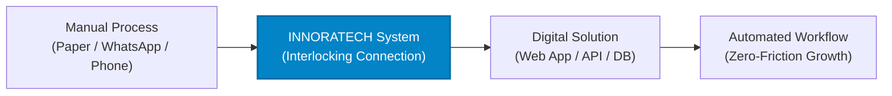

# INNORATECH Website — UI/UX Specification v1.0

> **Document Status:** Approved Design Baseline  
> **Version:** 1.0  
> **Companion Document:** [PRD.md](file:///c:/Users/shash/OneDrive/Desktop/INNORATECH/website_v1/PRD.md)  
> **Primary Design Directive:** *"Show the system, not just the service. Modern technology + business credibility + practical automation."*

---

## Executive Summary

While the **Project Requirements Document (PRD)** defines *what* the INNORATECH website must do, this **UI/UX Specification** defines *how* it looks, behaves, feels, and communicates.

INNORATECH's visual language communicates a clear identity:
**A professional technology solutions agency dedicated to eliminating manual business friction.**

It deliberately avoids two common agency traps:
1. **The Overly Flashy "Dribbble-Style" SaaS Template:** Avoids excessive neon gradients, distracting particle meshes, laggy 3D canvas objects, and hyper-trendy floating glass cards.
2. **The Generic Low-Effort Freelancer Portfolio:** Avoids lifeless corporate stock photography, generic bootstrap layouts, and walls of unformatted text.

---

## Table of Contents
1. [Design Direction & Personality](#1-design-direction--personality)
2. [Core Visual Concept & Symbolism](#2-core-visual-concept--symbolism)
3. [Color System & Design Tokens](#3-color-system--design-tokens)
4. [Typography Hierarchy](#4-typography-hierarchy)
5. [Grid System & Spacing Scale](#5-grid-system--spacing-scale)
6. [Border Radius Standards](#6-border-radius-standards)
7. [Elevation & Shadow Tokens](#7-elevation--shadow-tokens)
8. [Desktop Navigation Specification](#8-desktop-navigation-specification)
9. [Mobile Navigation Specification](#9-mobile-navigation-specification)
10. [Homepage Structural UI Hierarchy](#10-homepage-structural-ui-hierarchy)
11. [Hero Section Specification](#11-hero-section-specification)
12. [Hero Motion & Interactive Transformation](#12-hero-motion--interactive-transformation)
13. [Trust & Capability Strip](#13-trust--capability-strip)
14. [Problem Diagnosis Section](#14-problem-diagnosis-section)
15. [Problem Card UI Components](#15-problem-card-ui-components)
16. [Solutions Section (Outcome-Centric)](#16-solutions-section-outcome-centric)
17. [Solution Card Interactions](#17-solution-card-interactions)
18. [Industry Solution Detail Page Template](#18-industry-solution-detail-page-template)
19. [Workflow Visualization Architecture](#19-workflow-visualization-architecture)
20. [Agency Services Section](#20-agency-services-section)
21. [Service Detail Page Template](#21-service-detail-page-template)
22. [Work & Portfolio Strategy](#22-work--portfolio-strategy)
23. [Portfolio Card Component](#23-portfolio-card-component)
24. [Process Timeline Section](#24-process-timeline-section)
25. [Why INNORATECH Differentiator Cards](#25-why-innoratech-differentiator-cards)
26. [High-Conversion Bottom CTA Strip](#26-high-conversion-bottom-cta-strip)
27. [Contact Page Information Architecture](#27-contact-page-information-architecture)
28. [Contact Form Field Specifications](#28-contact-form-field-specifications)
29. [Form UX & Progressive Cognitive Load](#29-form-ux--progressive-cognitive-load)
30. [Form Interactive States](#30-form-interactive-states)
31. [Global Footer Design](#31-global-footer-design)
32. [Mobile UX Guidelines (First-Class Experience)](#32-mobile-ux-guidelines-first-class-experience)
33. [Responsive Layout & Breakpoint System](#33-responsive-layout--breakpoint-system)
34. [Atomic Component Design System Catalog](#34-atomic-component-design-system-catalog)
35. [Button System & Interactive States](#35-button-system--interactive-states)
36. [Iconography System](#36-iconography-system)
37. [Motion & Animation Guidelines](#37-motion--animation-guidelines)
38. [Accessibility (a11y) & Reduced Motion](#38-accessibility-a11y--reduced-motion)
39. [Content Design & Microcopy Rules](#39-content-design--microcopy-rules)
40. [Visual Asset Strategy](#40-visual-asset-strategy)
41. [Dark vs. Light Section Rhythm](#41-dark-vs-light-section-rhythm)
42. [Page-Level Route Index](#42-page-level-route-index)
43. [SEO-Friendly Semantic UI Hierarchy](#43-seo-friendly-semantic-ui-hierarchy)
44. [Full Homepage Structural Wireframe](#44-full-homepage-structural-wireframe)
45. [UX Conversion Principles](#45-ux-conversion-principles)
46. [UI/UX Acceptance Criteria](#46-uiux-acceptance-criteria)
47. [Final Core Design Principle](#47-final-core-design-principle)

---

## 1. Design Direction & Personality

```
========================================================================
 AGENCY:      INNORATECH
 TAGLINE:     Turn Manual Work Into Digital Solutions.
 MOOD:        Modern • Technical • Practical • Trustworthy • High-Utility
========================================================================
```

### Visual Attributes to Champion
- **Crisp Technical Precision:** High-contrast text, sharp 1px borders, subtle data grids, and clear structural hierarchy.
- **Outcome Grounding:** UI elements highlight operational efficiency (e.g. time saved, order routing, direct database persistence).
- **Executive Restraint:** White-space-driven readability, deliberate typography sizing, and controlled micro-interactions.

### Visual Pitfalls to Strictly Avoid ❌
- **Excessive Gradients:** No rainbow background blobs or illegible chromatic text overlays.
- **Glassmorphism Overload:** No heavy frosted-glass filters that ruin contrast and mobile GPU performance.
- **Aggressive Neon / Cyberpunk Styling:** No glowing neon purples, pinks, or artificial dark-hacker aesthetics.
- **Senseless Stock Photography:** No staged boardroom handshakes, generic models gazing at laptops, or stock sushi plates.
- **Cartoonish "Pill" Over-Rounding:** Avoid bloated 40px+ border radii on content containers.
- **Dense Unformatted Text Walls:** Content must be digestible through key-value matrices, bulleted lists, and step diagrams.

---

## 2. Core Visual Concept & Symbolism

The INNORATECH brand is anchored by its **blue interlocking symbol**, which conceptually represents:

$$\text{Connection} \longrightarrow \text{Integration} \longrightarrow \text{Workflow} \longrightarrow \text{Automation}$$

Every major diagram, hero visual, and feature graphic must reinforce this pipeline:



This establishes consistent visual storytelling across all customer touchpoints.

---

## 3. Color System & Design Tokens

A restrained, accessible color palette built around the primary INNORATECH Logo Blue. Functional status colors are strictly reserved for feedback states rather than decorative accents.

### CSS Design Tokens
```css
:root {
  /* Brand Primary (Sampled from official INNORATECH logo) */
  --brand-primary: #0284C7;        /* Sky-600 / Vibrant Tech Blue */
  --brand-primary-hover: #0369A1;  /* Sky-700 / Deepened hover state */
  --brand-primary-subtle: #E0F2FE; /* Sky-100 / Subtle badge background */
  --brand-primary-glow: rgba(2, 132, 199, 0.15);

  /* Typography / Foreground Colors */
  --text-primary: #0F172A;         /* Slate-900 / High-contrast headlines */
  --text-secondary: #334155;       /* Slate-700 / Body copy */
  --text-muted: #64748B;           /* Slate-500 / Captions, metadata, hints */
  --text-inverted: #FFFFFF;        /* Pure white for dark sections */

  /* Surface & Background Colors */
  --bg-primary: #FFFFFF;           /* Primary canvas */
  --bg-secondary: #F8FAFC;         /* Slate-50 / Alternate card & section fills */
  --bg-tertiary: #F1F5F9;          /* Slate-100 / Input fills, code boxes */
  --bg-dark: #0B1220;              /* Midnight Slate / Hero visual & footer */
  --bg-dark-surface: #131E32;      /* Elevated dark card surface */

  /* Structural Borders & Rules */
  --border: #E2E8F0;               /* Slate-200 / Standard divider & card stroke */
  --border-focus: #0284C7;         /* Active form stroke */
  --border-dark: #1E293B;          /* Slate-800 / Dark section card borders */

  /* Functional Status Colors (Non-decorative) */
  --success: #16A34A;              /* Emerald-600 / Validated & success states */
  --success-subtle: #DCFCE7;       /* Emerald-50 */
  --warning: #D97706;              /* Amber-600 / Cautions & pending badges */
  --warning-subtle: #FEF3C7;       /* Amber-50 */
  --error: #DC2626;                /* Red-600 / Form errors & alerts */
  --error-subtle: #FEE2E2;         /* Red-50 */
}
```

---

## 4. Typography Hierarchy

The typography stack utilizes **Inter** (or **Outfit** for display accents), prioritizing razor-sharp legibility, tight tracking on headings, and generous line height for long-form scanability.

| Token | Desktop Font Size | Mobile Font Size | Weight | Line Height | Tracking | Purpose |
| :--- | :--- | :--- | :--- | :--- | :--- | :--- |
| `text-display` | 64px – 72px | 38px – 44px | 800 (Bold) | 1.05 | -0.025em | Main Hero Impact Headline |
| `text-h1` | 48px – 60px | 32px – 36px | 700 (Bold) | 1.15 | -0.02em | Section Headings |
| `text-h2` | 32px – 40px | 26px – 30px | 700 (Bold) | 1.25 | -0.015em | Major Feature / Section Titles |
| `text-h3` | 22px – 26px | 20px – 22px | 600 (Semi-bold) | 1.35 | -0.01em | Card & Subsection Titles |
| `text-h4` | 18px – 20px | 17px – 18px | 600 (Semi-bold) | 1.4 | normal | Sub-items & List Headers |
| `text-body-lg` | 18px – 20px | 16px – 17px | 400 (Regular) | 1.6 | normal | Hero Supporting Paragraphs |
| `text-body` | 16px | 15px – 16px | 400 (Regular) | 1.6 | normal | Standard Body Copy & Descriptions |
| `text-small` | 14px | 13px – 14px | 500 (Medium) | 1.5 | normal | Form labels, Meta, Footnotes |
| `text-caption` | 12px – 13px | 11px – 12px | 600 (Semi-bold) | 1.4 | +0.05em | Uppercase Eyebrows & Badges |

---

## 5. Grid System & Spacing Scale

Layouts must sit inside a centered, fixed-width boundary to prevent line-length degradation on ultra-wide screens.

- **Desktop Max Container:** `1240px` (with `24px` gutter padding on sides).
- **Tablet Gutter:** `20px`.
- **Mobile Gutter:** `16px`.

### 8-Point Spacing Scale
All margins, paddings, and component gaps must strictly adhere to the standard 8px grid:

```
  px-1   → 4px    | px-4   → 16px   | px-8   → 32px   | px-16  → 64px   | px-24  → 96px
  px-2   → 8px    | px-5   → 20px   | px-10  → 40px   | px-20  → 80px   | px-30  → 120px
  px-3   → 12px   | px-6   → 24px   | px-12  → 48px   |
```

*Rule:* Never apply ad-hoc, random margin values (e.g. `margin-top: 37px;`). Always select the nearest token from the scale above.

---

## 6. Border Radius Standards

Keep corner radii crisp and engineered. Avoid oversized bubbles.

- **Inputs, Checkboxes & Micro-Badges:** `6px – 8px`
- **Buttons:** `8px`
- **Standard Cards (Problem, Solution, Service):** `12px – 16px`
- **Large Elevated Visual Containers & Modals:** `16px – 24px`
- **Pill Badges:** `9999px` (Strictly reserved for small category tags like `[Concept Demo]`).

---

## 7. Elevation & Shadow Tokens

Surfaces rely primarily on clean 1px borders (`#E2E8F0`) and high contrast rather than dark, muddy dropshadows.

```css
/* Card default rest state */
--shadow-subtle: 0 1px 3px 0 rgba(0, 0, 0, 0.05), 0 1px 2px -1px rgba(0, 0, 0, 0.05);

/* Card interactive hover state */
--shadow-card-hover: 0 10px 15px -3px rgba(15, 23, 42, 0.08), 0 4px 6px -4px rgba(15, 23, 42, 0.04);

/* Dropdown menus & sticky navigation on scroll */
--shadow-dropdown: 0 12px 28px -4px rgba(15, 23, 42, 0.12);

/* Elevated Modals & Overlays */
--shadow-modal: 0 25px 50px -12px rgba(15, 23, 42, 0.25);
```

---

## 8. Desktop Navigation Specification

```
┌────────────────────────────────────────────────────────────────────────────────────────┐
│  [INNORATECH LOGO]       Solutions   Services   Work   Process   About        [Start a Project]│
└────────────────────────────────────────────────────────────────────────────────────────┘
```

- **Height:** `72px` (reduces to `64px` on scroll).
- **Position:** `sticky; top: 0; z-index: 50;`
- **Scroll Behavior:**
  - Initial state: Transparent background or pure white flush with the hero.
  - Active scroll state: Background transitions to `rgba(255, 255, 255, 0.95)` with `backdrop-filter: blur(8px)`, displaying a 1px border-bottom (`#E2E8F0`) and `--shadow-subtle`.
- **Navigation Links:** `15px`, medium weight (`500`), `#334155`. Hover state transitions to `#0284C7` with a subtle bottom underline indicator.
- **CTA Button:** Primary brand blue button pinned to the right edge.

---

## 9. Mobile Navigation Specification

```
┌────────────────────────────────────────────────────────┐
│  [INNORATECH LOGO]                                 [☰] │
└────────────────────────────────────────────────────────┘
```

- **Header Bar:** `64px` fixed height with logo and accessible hamburger icon (`48x48px` touch target).
- **Flyout Overlay:** Smooth slide-down or full-screen overlay (`#FFFFFF` background).
- **Navigation Stack:**
  - `/` (Home)
  - `/solutions` (With expandable sub-accordions: Restaurants, Hotels, Bakeries, Custom Automation)
  - `/services`
  - `/work`
  - `/process`
  - `/about`
  - `/contact`
- **Bottom Pinned Element:** Full-width `Start a Project` button (`h: 52px`) ensuring high thumb-reach conversion.

---

## 10. Homepage Structural UI Hierarchy

The homepage is organized as a deliberate conversion funnel:

```
  [1] Navigation Bar (Sticky with Logo + Links + Primary CTA)
  [2] Hero Section (Eyebrow + H1 + Value Prop + Dual CTAs + Workflow Engine Visual)
  [3] Trust & Capabilities Strip (Horizontal highlight of core digital domains)
  [4] Problem Diagnosis ("Still Running Important Processes Manually?")
  [5] Outcome Solutions Grid (Restaurants, Hotels, Bakeries, Custom Automation)
  [6] Agency Core Services (Websites, Web Apps, Automation, Integrations, DevOps)
  [7] How We Work (Interactive 7-Step Delivery SOP Timeline)
  [8] Featured Work (Concept demos with explicit badge classification)
  [9] Why INNORATECH (Practical engineering philosophy & differentiators)
  [10] Inbound Lead CTA Strip ("Have a manual process you want to fix?")
  [11] Global Footer (Sitemap, legal links, contact details)
```

---

## 11. Hero Section Specification

### Desktop Blueprint

```
┌─────────────────────────────────────────────────────────────────────────────────────┐
│                                                                                     │
│  [EYEBROW: BUSINESS TECHNOLOGY SOLUTIONS]          ┌─────────────────────────────┐  │
│                                                    │  WORKFLOW ENGINE VISUAL     │  │
│  Turn Manual Work                                  │                             │  │
│  Into Digital Solutions.                           │  [Manual Orders]            │  │
│                                                    │         ↓                   │  │
│  INNORATECH helps businesses replace manual        │  [INNORATECH Core Engine]   │  │
│  processes with modern websites, web applications, │         ↓                   │  │
│  automation, and connected systems.                │  [Automated Business Flow]  │  │
│                                                    │                             │  │
│  [Start a Project →]    [Explore Solutions]        └─────────────────────────────┘  │
│                                                                                     │
└─────────────────────────────────────────────────────────────────────────────────────┘
```

- **Eyebrow Tag:** `13px`, Uppercase, tracking `+0.05em`, color `#0284C7`, font weight `600`.
- **H1 Headline:** `56px – 64px`, font weight `800`, line height `1.1`, color `#0F172A`.
- **Supporting Body:** `18px`, color `#475569`, max reading width `540px`.
- **CTA Group:** Primary button (`Start a Project`) paired with neutral secondary outline (`Explore Solutions`), gap `16px`.

---

## 12. Hero Motion & Interactive Transformation

The hero visual is **not** an arbitrary 3D render or generic illustration. It is a live, stylized schematic depicting how manual chaos turns into an automated pipeline:

```
  [Node A: Phone / Paper Slips] ──(Pulse Line)──> [Node B: INNORATECH Gateway] ──(Pulse Line)──> [Node C: Live Dashboard + DB]
```

- **Interactive Behavior:** Hovering over any stage temporarily pauses the animation and highlights the operational benefit (e.g. *"95% reduction in manual order entry"*).
- **Motion Restraint:** Animation pulse frequency is gentle (`3.5s` linear cycle). Zero aggressive flashing or rapid rotations.

---

## 13. Trust & Capability Strip

Positioned directly beneath the hero visual to reinforce capabilities within 3 seconds of arrival:

```
  WEBSITES  •  WEB APPLICATIONS  •  BUSINESS AUTOMATION  •  API INTEGRATIONS  •  CLOUD RUNTIMES
```

- **Background:** Subtle `#F8FAFC` slate fill with 1px top and bottom border.
- **Typography:** `13px`, medium weight `600`, letter-spacing `+0.08em`, color `#64748B`.
- **Divider:** Subtle brand-blue circular bullet `•` (`#0284C7`).

---

## 14. Problem Diagnosis Section

- **Eyebrow:** `THE BOTTLENECK`
- **Main Heading (H2):** `Still Running Important Processes Manually?`
- **Subtext:** *Every hour your team spends manually copying orders, fielding booking phone calls, or reconciling spreadsheets is lost profit and operational drag.*

### 4-Card Comparison Grid

```
┌───────────────────────────┬───────────────────────────┐
│ [🍽️] RESTAURANTS          │ [🏨] HOTELS               │
│ Paper-based dine-in orders│ Fragmented reservations   │
│ Phone calls and handwritten│ WhatsApp chats, calls and │
│ tickets delay kitchen prep│ multiple external OTAs    │
│ and cause errors.         │ lead to double bookings.  │
│ [See Restaurant Solution →│ [See Hotel Solution →]    │
├───────────────────────────┼───────────────────────────┤
│ [🎂] BAKERIES             │ [⚙️] OPERATIONS           │
│ Disorganized custom orders│ Disconnected software     │
│ Custom cake notes & pickup│ Staff waste 2-3 hrs daily │
│ schedules get lost in chat│ re-entering data across   │
│ message threads.          │ isolated tools.           │
│ [See Bakery Solution →]   │ [See Custom Automation →] │
└───────────────────────────┴───────────────────────────┘
```

---

## 15. Problem Card UI Components

- **Rest State:** `#FFFFFF` background, 1px border `#E2E8F0`, padding `32px`, border-radius `16px`, `--shadow-subtle`.
- **Header Icon:** `44x44px` container with `#F1F5F9` background; icon in `#334155`.
- **Card Hover State:**
  - Card translates `Y: -4px`.
  - Border highlights to `var(--brand-primary)`.
  - Icon container transitions to `var(--brand-primary-subtle)` with icon in `var(--brand-primary)`.
  - Arrow link `[See Solution →]` slides `4px` to the right.
- **Transition Duration:** `200ms cubic-bezier(0.16, 1, 0.3, 1)`.

---

## 16. Solutions Section (Outcome-Centric)

- **Eyebrow:** `ENGINEERED OUTCOMES`
- **Main Heading (H2):** `Solutions Built Around the Way Your Business Works.`
- **Content Framing:** Positioned strictly around operational outcomes, not raw programming libraries.

```
┌────────────────────────────────────────────────────────────────────────┐
│ 1. RESTAURANTS: Direct Digital Ordering & Kitchen Flow                 │
│    Zero 3rd-party commissions • QR Table Ordering • POS Integration    │
├────────────────────────────────────────────────────────────────────────┤
│ 2. HOTELS: Direct Commission-Free Booking Engine                       │
│    Real-time room availability • WhatsApp check-in alerts • Stripe/UPI │
├────────────────────────────────────────────────────────────────────────┤
│ 3. BAKERIES: Custom Cake Builder & Production Run-Sheets               │
│    Multi-attribute design builder • Pickup slot locks • Daily prep PDF │
├────────────────────────────────────────────────────────────────────────┤
│ 4. CUSTOM AUTOMATION: Centralized Operations Dashboards                │
│    Two-way API sync • Lightweight CRM • Automated customer reminders   │
└────────────────────────────────────────────────────────────────────────┘
```

---

## 17. Solution Card Interactions

Each solution card acts as a high-intent portal. Clicking any card routes cleanly to:
- `/solutions/restaurants`
- `/solutions/hotels`
- `/solutions/bakeries`
- `/solutions/custom-business-automation`

Card interaction features an embedded preview of the live workflow and direct feature bullets with checkmark icons.

---

## 18. Industry Solution Detail Page Template

Every vertical page follows a standardized, trust-building information architecture:

```
  [1] Page Hero: Industry-specific headline & quantified business outcome
  [2] The Cost of Manual Work: Before-and-after operational comparison
  [3] Key System Features: Feature grid with interactive capability tags
  [4] Interactive Workflow Visual: Step-by-step data journey from customer to operator
  [5] Tangible Operational Benefits: Measured efficiency gains (e.g. 0% Commission)
  [6] Interactive Product Demo / Walkthrough: Realistic product UI mockup
  [7] Specific Vertical FAQ: Addressing setup time, POS compatibility, staff training
  [8] Target CTA: "Deploy This System in Your Business"
```

---

## 19. Workflow Visualization Architecture

A visual cornerstone of the INNORATECH identity. Displays the end-to-end operational pipeline:

### Restaurant Pipeline Visualization
```
  [Customer Phone] ──> [QR Code Scan] ──> [Digital Menu] ──> [Instant UPI Payment] 
                                                                     │
  [Kitchen Display System] <── [Order Routing Engine] <──────────────┘
```

### Hotel Pipeline Visualization
```
  [Guest Device] ──> [Hotel Booking Engine] ──> [Room Selector] ──> [Guaranteed Deposit]
                                                                            │
  [Guest WhatsApp Alert] <── [Reservation Dashboard] <──────────────────────┘
```

- **Desktop View:** Horizontal pipeline connected by dynamic SVG pulse lines.
- **Mobile View:** Clean vertical stack with numbered step badges.

---

## 20. Agency Services Section

Separates core engineering disciplines from packaged industry solutions:

```
┌───────────────────────────┬───────────────────────────┐
│ 01 | Business Websites    │ 02 | Web Applications     │
│ High-conversion responsive│ Bespoke internal tools,   │
│ sites built for growth.   │ portals, and dashboards.  │
├───────────────────────────┼───────────────────────────┤
│ 03 | Business Automation  │ 04 | API & Integrations   │
│ Streamlined workflows to  │ Payment gateways, CRM,    │
│ eliminate repetitive tasks│ WhatsApp & custom APIs.   │
├───────────────────────────┴───────────────────────────┤
│ 05 | Managed Cloud Deployment & Continuous Maintenance│
│ Serverless speed, automated backups, and 99.9% uptime.│
└───────────────────────────────────────────────────────┘
```

---

## 21. Service Detail Page Template

*(e.g., `/services/business-automation`)*

- **Hero:** `Automate the Work Your Team Repeats Every Day.`
- **Structure:**
  1. *What We Automate:* Concrete examples (Invoice reconciliation, customer reminders, lead routing).
  2. *Before & After Flowchart:* Visualizing hours reclaimed.
  3. *Supported Integrations:* Official partner logos (Stripe, Razorpay, WhatsApp Cloud, Twilio, Google Cloud).
  4. *Security & Reliability Standards:* Encryption, token security, error fallbacks.
  5. *Direct CTA:* Request a discovery audit.

---

## 22. Work & Portfolio Strategy

### V1 Demo Project Showcase
Initial V1 showcase features three production-grade demonstration concepts:
1. **Restaurant Digital Ordering System** — Concept Project & Demo
2. **Hotel Direct Booking Platform** — Concept Project & Demo
3. **Bakery Custom Order & Production Workflow** — Concept Project & Demo

> [!IMPORTANT]
> **Mandatory Badge Classification:**
> - Concept builds are labeled: `[INNORATECH Demo]` in blue.
> - Commercial client builds are labeled: `[Client Project]` in emerald green.

---

## 23. Portfolio Card Component

```
┌────────────────────────────────────────────────────────┐
│ ┌────────────────────────────────────────────────────┐ │
│ │                                                    │ │
│ │  HIGH-RESOLUTION PRODUCT UI MOCKUP                 │ │
│ │  (Real interface screenshot, not stock art)        │ │
│ │                                                    │ │
│ └────────────────────────────────────────────────────┘ │
│                                                        │
│  [INNORATECH DEMO]  •  Hospitality                     │
│  Restaurant Digital Ordering System                    │
│  Replaces phone calls with instant table QR orders     │
│  and automated kitchen receipts.                       │
│                                                        │
│  Next.js • Tailwind • Supabase • WhatsApp API          │
│                                                        │
│  View Case Study & Live Demo →                         │
└────────────────────────────────────────────────────────┘
```

---

## 24. Process Timeline Section

- **Heading (H2):** `From Business Problem to Working Digital System.`
- **Structure:** Transparent 7-step engineering methodology:

```
  01 DISCOVER ──> 02 DEFINE ──> 03 DESIGN ──> 04 BUILD ──> 05 TEST ──> 06 LAUNCH ──> 07 SUPPORT
```

- **Desktop:** Horizontal step journey with milestone indicators.
- **Mobile:** Vertical connected timeline with numbered step markers (`01` through `07`).

---

## 25. Why INNORATECH Differentiator Cards

Replaces generic agency rhetoric with engineering realities:

```
┌───────────────────────────┬───────────────────────────┐
│ 🎯 Problem-First          │ 🛠️ Practical Solutions   │
│ We understand your actual │ We build right-sized      │
│ daily workflow before we  │ systems suited to your    │
│ write a single line code. │ true operational budget.  │
├───────────────────────────┼───────────────────────────┤
│ 🔗 Connected Architecture │ 🤝 Long-Term Partnership  │
│ We connect isolated tools │ We maintain and evolve    │
│ so data flows cleanly.    │ your systems post-launch. │
└───────────────────────────┴───────────────────────────┘
```

---

## 26. High-Conversion Bottom CTA Strip

- **Section Background:** Dark Slate (`#0B1220`) for visual contrast and final focus.
- **Eyebrow:** `READY TO ELIMINATE MANUAL FRICTION?`
- **Headline (H2):** `Have a Manual Process You Want to Fix?`
- **Subtext:** *Tell us how your business currently operates. We will map out where modern software can eliminate repetitive work and drive direct revenue.*
- **CTA Actions:**
  - Primary: `Start a Project →` (High-contrast `#0284C7` button)
  - Secondary: `Talk to an Engineer` (Ghost button with border)

---

## 27. Contact Page Information Architecture

Two-column balanced layout on desktop (`≥ 1024px`):

```
┌─────────────────────────────────────┬─────────────────────────────────────┐
│ COLUMN 1: AGENCY CONTEXT & DETAILS  │ COLUMN 2: SMART ENQUIRY FORM        │
│                                     │                                     │
│ Let's Build Something Useful.       │ [Progressive 3-Tier Input Fields]   │
│                                     │                                     │
│ Direct Founder Channels:            │ [1. About You]                      │
│ • contact@innoratech.com            │ [2. About The Project]              │
│ • WhatsApp Business Direct          │ [3. Additional Context]             │
│ • Bengaluru / Global Remote         │                                     │
│                                     │ [Submit Project Enquiry Button]     │
└─────────────────────────────────────┴─────────────────────────────────────┘
```

---

## 28. Contact Form Field Specifications

### Core Form Fields
1. **Full Name** (`text`, required)
2. **Business Name** (`text`, required)
3. **Email Address** (`email`, required)
4. **Phone / WhatsApp** (`tel`, required, with country code selector)
5. **Business Type** (`select`, required: Restaurant, Hotel, Bakery, Retail, Manufacturing, Healthcare, Services, Startup, Other)
6. **What do you need?** (`multi-select / pills`, required: Business Website, Web App, Online Ordering, Booking System, E-commerce, Automation, Integrations, Maintenance, Consultation)
7. **Problem Description** (`textarea`, required: *"What manual task consumes the most time in your business?"*)
8. **Current Website / Social Link** (`url`, optional)
9. **Estimated Budget Range** (`select`, optional: Tier 1, Tier 2, Tier 3, Enterprise)
10. **Preferred Contact Method** (`radio`: WhatsApp, Email, Phone Call)

---

## 29. Form UX & Progressive Cognitive Load

To prevent abandonment, the form is divided into **3 clear visual groups** (single-page flow, no multi-step wizard delays):

```
  ┌────────────────────────────────────────────────────────┐
  │ STEP 1: ABOUT YOU (Name, Business, Email, Phone)       │
  ├────────────────────────────────────────────────────────┤
  │ STEP 2: ABOUT THE PROJECT (Type, Services, Problem)    │
  ├────────────────────────────────────────────────────────┤
  │ STEP 3: DETAILS (Budget, Website, Preferred Channel)   │
  └────────────────────────────────────────────────────────┘
```

---

## 30. Form Interactive States

- **Default State:** Clean `#FFFFFF` fill, 1px `#CBD5E1` border, 8px radius.
- **Focus State:** 2px ring in `#0284C7` with subtle glow (`rgba(2, 132, 199, 0.15)`).
- **Error State:** 1px border `#DC2626` with red error message beneath the input.
- **Submitting State:** Button disabled with spinning indicator and text: `Submitting Your Project...`
- **Success State:**
  ```
  ✓ Project Enquiry Received!
  Thank you. Our founders will review your operational requirements
  and reach out within 24 business hours.
  ```
- **Failure State:**
  ```
  ⚠️ Submission Error: Unable to send enquiry.
  Please try again or email us directly at contact@innoratech.com.
  ```

---

## 31. Global Footer Design

- **Background:** `#0B1220` with top border `#1E293B`.
- **Columns:**
  - **Col 1 (Brand):** INNORATECH Logo, Tagline (*"Turn Manual Work Into Digital Solutions"*), Copyright © 2026.
  - **Col 2 (Solutions):** Restaurants, Hotels, Bakeries, Custom Automation.
  - **Col 3 (Services):** Websites, Web Apps, Automations, Integrations, DevOps.
  - **Col 4 (Agency):** About, Process, Work, Contact, Privacy Policy, Terms.

---

## 32. Mobile UX Guidelines (First-Class Experience)

1. **Touch Targets:** Minimum touch zone of `48px x 48px` for all clickable elements.
2. **Zero Horizontal Overflow:** Strict containment; no horizontal scrollbars on mobile.
3. **Verticalized Pipelines:** Horizontal desktop workflow diagrams convert into sequential vertical steps.
4. **Readable Typography:** Minimum mobile font size of `15px` for body copy to prevent zoom triggers.
5. **No Hover Dependency:** Critical data and links are permanently accessible without requiring hover states.

---

## 33. Responsive Layout & Breakpoint System

```css
/* Tailwind & CSS Media Breakpoints */
--screen-sm:  640px;   /* Large Mobile Phones */
--screen-md:  768px;   /* Tablets (Portrait) */
--screen-lg:  1024px;  /* Tablets (Landscape) / Small Laptops */
--screen-xl:  1280px;  /* Standard Desktop */
--screen-2xl: 1536px;  /* Ultra-wide Monitors */
```

---

## 34. Atomic Component Design System Catalog

```
innoratech-ui/
├── typography/       # Eyebrow, Heading, Paragraph, Code
├── buttons/          # PrimaryButton, SecondaryButton, GhostButton, IconButton
├── cards/            # ProblemCard, SolutionCard, ServiceCard, PortfolioCard
├── forms/            # TextInput, SelectDropdown, Textarea, PillSelect, RadioGroup
├── feedback/         # FormAlert, Toast, Badge, StatusIndicator
├── navigation/       # Navbar, MobileDrawer, Footer, Breadcrumbs
└── diagrams/         # WorkflowPipeline, TransformationGraph, StepRoadmap
```

---

## 35. Button System & Interactive States

```css
/* Primary Action Button */
.btn-primary {
  background: var(--brand-primary);
  color: #FFFFFF;
  padding: 12px 24px;
  font-weight: 600;
  border-radius: 8px;
  box-shadow: 0 1px 2px rgba(0, 0, 0, 0.05);
  transition: all 150ms ease-in-out;
}
.btn-primary:hover {
  background: var(--brand-primary-hover);
  transform: translateY(-1px);
}
.btn-primary:focus-visible {
  outline: 2px solid var(--brand-primary);
  outline-offset: 2px;
}
.btn-primary:disabled {
  opacity: 0.6;
  cursor: not-allowed;
  transform: none;
}
```

---

## 36. Iconography System

- **Standardized Library:** **Lucide Icons** (clean, consistent 2px stroke line icons).
- **Prohibited:** No mixing of FontAwesome, material glyphs, or colored emojis inside technical cards.
- **Stroke Width:** Uniform `1.75px` to `2.0px`.

---

## 37. Motion & Animation Guidelines

Motion serves comprehension and feedback, never distraction.

- **Page Transition:** Smooth opacity fade `0ms` to `200ms`.
- **Card Hover:** Subtle translate `Y: -4px`, duration `180ms ease-out`.
- **Accordion Toggle:** Height transition `250ms ease-in-out`.
- **Explicit Prohibitions:** No spinning brand logos, continuous floating background bubbles, or mouse-tracking particle webs.

---

## 38. Accessibility (a11y) & Reduced Motion

- **Contrast Ratios:** Minimum `4.5:1` for normal text; `3.0:1` for large headlines and UI boundaries.
- **Keyboard Traversal:** Logical tab order across all cards, links, and form fields with clear `:focus-visible` styling.
- **Reduced Motion Support:**
```css
@media (prefers-reduced-motion: reduce) {
  *, ::before, ::after {
    animation-duration: 0.01ms !important;
    animation-iteration-count: 1 !important;
    transition-duration: 0.01ms !important;
    scroll-behavior: auto !important;
  }
}
```

---

## 39. Content Design & Microcopy Rules

- **Formula:** Problem $\longrightarrow$ Solution $\longrightarrow$ Tangible Outcome.
- **Avoid:** *"We deliver full-stack enterprise cloud architectures with cutting-edge tech."*
- **Champion:** *"We connect your customer orders directly to your kitchen and bank account, eliminating manual phone orders."*

---

## 40. Visual Asset Strategy

Three visual asset classes:
1. **Interactive Vector Schematics:** Highlighting data pipelines and workflow connections.
2. **True Product Screenshots:** Clean application UI captures placed in subtle device frames.
3. **Branded Technical Line Graphics:** Geometric illustrations echoing the interlocking brand motif.

---

## 41. Dark vs. Light Section Rhythm

Alternating black and white on every section causes visual fatigue. INNORATECH utilizes a disciplined cadence:

```
  1. Hero Area: Crisp Light (#FFFFFF) with subtle grid
  2. Capability Strip: Soft Slate (#F8FAFC)
  3. Problem Section: Clean Light (#FFFFFF)
  4. Solutions Section: Soft Slate (#F8FAFC)
  5. Services Section: Clean Light (#FFFFFF)
  6. Delivery Process: Clean Light (#FFFFFF)
  7. Work & Case Studies: Soft Slate (#F8FAFC)
  8. Why INNORATECH: Clean Light (#FFFFFF)
  9. Pre-Footer Conversion CTA: Deep Tech Midnight (#0B1220)
  10. Global Footer: Deep Tech Midnight (#0B1220)
```

---

## 42. Page-Level Route Index

- `/` — Homepage conversion engine.
- `/solutions` — Solutions matrix.
- `/solutions/restaurants` — Restaurant vertical.
- `/solutions/hotels` — Hotel vertical.
- `/solutions/bakeries` — Bakery vertical.
- `/solutions/custom-business-automation` — Custom automation vertical.
- `/services` — Agency technical capabilities.
- `/work` — Concept demos & client case studies.
- `/work/[slug]` — In-depth project breakdown.
- `/process` — Detailed 7-step engineering SOP.
- `/about` — Founding team, mission, and vision.
- `/contact` — Smart project enquiry engine.

---

## 43. SEO-Friendly Semantic UI Hierarchy

Every page enforces clean semantic markup:
- Exact **one** `<h1>` tag containing primary keyword positioning.
- Section titles marked as `<h2>`.
- Card and feature sub-titles marked as `<h3>`.
- No heading tags used purely for CSS size adjustments.

---

## 44. Full Homepage Structural Wireframe

```
┌────────────────────────────────────────────────────────────────────────┐
│ NAVBAR: [INNORATECH LOGO]   Solutions Services Work Process About [CTA]│
├────────────────────────────────────────────────────────────────────────┤
│ HERO:                                                                  │
│ Turn Manual Work Into Digital Solutions.                               │
│ [Start a Project] [Explore Solutions]        [WORKFLOW VISUAL ENGINE]  │
├────────────────────────────────────────────────────────────────────────┤
│ CAPABILITIES: WEBSITES • WEB APPS • AUTOMATION • APIS • CLOUD          │
├────────────────────────────────────────────────────────────────────────┤
│ PROBLEMS: [Restaurants]   [Hotels]   [Bakeries]   [Operations]         │
├────────────────────────────────────────────────────────────────────────┤
│ SOLUTIONS: Direct Ordering | Direct Booking | Custom Orders | Automate │
├────────────────────────────────────────────────────────────────────────┤
│ SERVICES: Websites | Web Applications | Automation | APIs | Cloud      │
├────────────────────────────────────────────────────────────────────────┤
│ PROCESS: 01 Discover → 02 Define → 03 Design → 04 Build → Launch       │
├────────────────────────────────────────────────────────────────────────┤
│ FEATURED WORK: [Restaurant Demo]   [Hotel Demo]   [Bakery Demo]        │
├────────────────────────────────────────────────────────────────────────┤
│ WHY INNORATECH: Problem-First | Practical | Connected | Long-Term      │
├────────────────────────────────────────────────────────────────────────┤
│ FINAL CTA: Have a Manual Process You Want to Fix?   [Start a Project]  │
├────────────────────────────────────────────────────────────────────────┤
│ FOOTER: Links • Contact • Socials • Legal • © 2026 INNORATECH          │
└────────────────────────────────────────────────────────────────────────┘
```

---

## 45. UX Conversion Principles

Every section answers at least one of these 5 critical buyer questions:
1. **What does INNORATECH do?** (Clarified in Hero & Capabilities Strip).
2. **Can INNORATECH solve my specific problem?** (Answered in Problem & Solutions sections).
3. **How does INNORATECH solve it?** (Demonstrated in Workflow Visualizations).
4. **Can I trust them?** (Proven via Process, Work Demos, and Founders' About page).
5. **How do I start?** (Directly channeled via the Smart Enquiry Form).

---

## 46. UI/UX Acceptance Criteria

Design specifications are verified complete when:
- [ ] Brand tokens, typography scale, and 8px spacing grid are formally defined.
- [ ] Desktop and mobile wireframe layouts for all 12 routes are approved.
- [ ] Reusable component tokens (buttons, cards, inputs, workflows) are documented.
- [ ] Hover, active, focus, and error states are documented for all inputs and CTAs.
- [ ] WCAG 2.1 AA accessibility guidelines and reduced-motion standards are met.
- [ ] Visual asset rules (real screenshots & schematics over stock photos) are enforced.

---

## 47. Final Core Design Principle

> ### *"Show the system, not just the service."*

Instead of a generic stock photo of a hotel lobby or restaurant table, INNORATECH displays:

$$\text{Customer} \longrightarrow \text{QR / Web} \longrightarrow \text{Live Menu} \longrightarrow \text{Payment} \longrightarrow \text{Automated Kitchen / PMS}$$

This visual language makes INNORATECH's value instantly evident to any visiting business owner.
